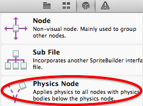
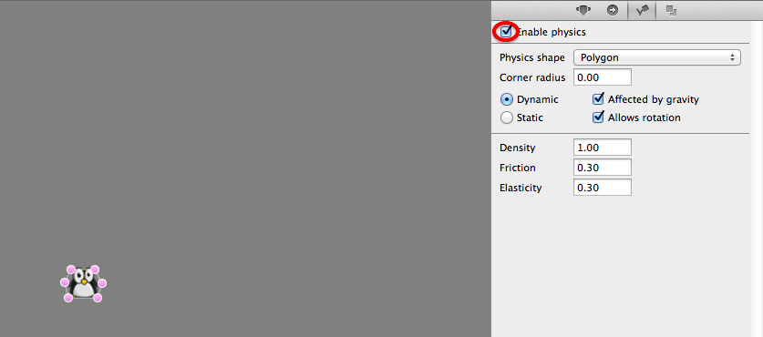

#Setup physics in SpriteBuilder

Basic physics properties can be easily applied within SpriteBuilder. In a future release SpriteBuilder will also support creating physics joints.

##Adding a Physics Node

A physics node needs to be added as a parent for any physics object. In SpriteBuilder a physics node can be added directly from the node library:

##Setting up Physics Bodies

In SpriteBuilder any selected Node can be turned into a physics body:

The shape of a physics body can be changed by dragging multiple points from the outline of the object. The physics body shape can either be a polygon or a circle.
The third tab in the inspector pane on the right reveals all physics properties that can be manipulated in SpriteBuilder.