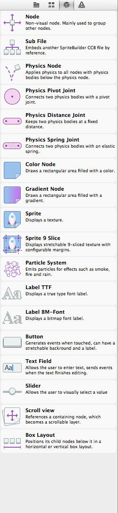

The third panel of the Resources Browser is known as the Node Library.  The Node Library provides you with a drag-and-drop interface for creating some of the foundational elements for any Cocos2D game including nodes, sprites, buttons and particle systems and joints for physics bodies.  This section will provide an in-depth look at each of the nodes available through the Node Library, their functionality, and how they can be used when building games with SpriteBuilder.

The node library for SpriteBuilder v1.1