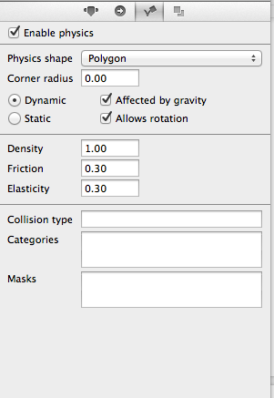

#What a Physics Engine Does
    There are certain common features that almost every game shares, one of which is the need to handle physical simulations of the interactions between objects and forces.  As a result, physics engines have been developed which handle the low-level processing of these events and allow the game programmer to focus on designing the way objects interact.   Cocos2D uses the Chipmunk2D physics engine, and you can read more about it [here](insert link to Chipmunk2D page).

    SpriteBuilder provides a simple user interface in the properties panel for setting the physical properties on any node.  When you select the node on the stage and navigate to the third panel, Item Physics, you can activate physics for a body by simply checking the Enable physics box.  The properties panel then allows you to alter the following propreties of the body within the physics simulation:

    Physics shape - The shape that Cocos2D uses to detect physical collisions.  The shape should roughly match the shape of the item you are wrapping, though the more complex the shape the more processing power it will take to calculate possible collisions in each frame.

    Dynamic/Static - If an object is set as static it will remain stationary despite whatever other forces attempt to act on it (gravity, spring, collision).  Setting an object as static saves processing power and should be applied to objects like surfaces that the player moves across which require collision detection, but not other physical properties.

    Affected by gravity/allow rotation - Determine how a physical body will respond under the influence of gravity or rotation.

    Density/Friction/Elasticity - Allow you to set the internal properties of the object which the physics engine can then apply to its interaction with other physics bodies.

    Collision Type/Categories/Masks - I have no idea what these do

    How is mass determined?

    (physics in sb page, build on what's there to demonstrate application of proerties)