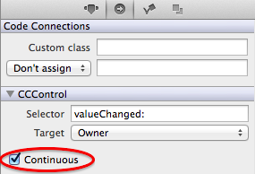

##Connecting callbacks for interactive elements
SpriteBuilder and Cocos2D provide a couple of interactive UI elements out of the box, e.g. buttons or sliders. A developer can setup callback methods that shall be called when actions on these UI elements occur. 

Just as the member variable connections the callbacks can be either linked to the *Document Root* or to the *Owner*. 

###Basic callback

This basic callback example uses a *Button*. Selecting a *Button* on the stage will cause a new section called *CCControl* to appear in the right panel.

- The method name can be entered in the *selector* field
- The corresponding class (either the *Document Root* or the *Owner*) need to implement a method with that name

In this example the `play` method on the *Owner* will be called once the button is touched. Since the selector name is `play` the method implementation should have no parameters:

    - (void)play {
        CCLOG(@"play");
    }

###Passing the sender to the callback method
For some UI components it makes sense to pass the sender (the UI component on which the event ocurred) into the callback method. E.g. when using a slider a developer will often want to access the current value of the slider after it changed.

If the sender shall be contained as a parameter the selector needs to contain a colon:

If the selector contains a colon the implemented callback needs to take one parameter. The type can be either `id` or the type of the actual control, e.g. `CCSlider`.

    - (void)valueChanged:(CCSlider *)slider {
        CCLOG(@"%f", slider.sliderValue);
    }
    
###Using the continuous option

This option is applicable to UI components that change their value gradually, for example a `CCSlider`. If *Continous* is checked the callback will be called every time the value gets changed. If *Continous* is not checked the callback is only called when the user stops interacting with the slider and the slider stops in the final position.