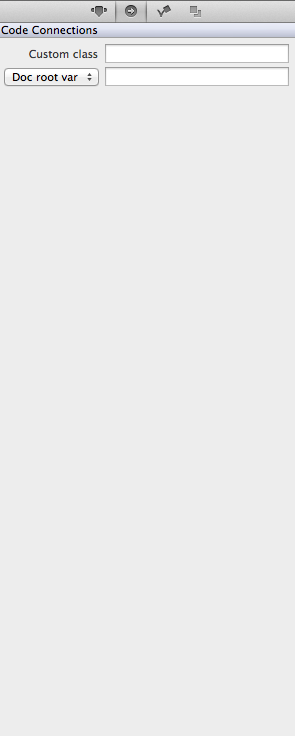

#Using the Code Connections Panel

The second tab of the SpriteBuilder properties panel is the code connections panel.

The first option that can be specified in this panel, custom class, refers to the class which the node implements.  By default this will be whatever node type was used to create this instance of the object.  If the node was created from the node library by dragging the sprtie node onto the stage, than the default class wolud be CCSprite.

The second option is the node's variable binding.  Whatever name is specified in this box will be the instance name that is used to access the node in code.  When Doc Root var is specified this instance will be created in the class of the scene's root node.  When a new project is created this class will be MainScene.  Otherwise, the 2nd property can be set to owner var which means the instance will occur in the variable's owner as specified in code??????