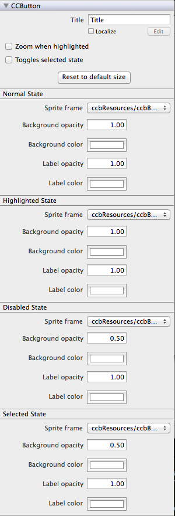

#Working with Buttons
A button is a composite of a number of different CCTypes which work together to give the apperance of a single button. The CCControl handles the user's touch interaction with the button.  As a result, the size of the button is linked directly to the size of the CCControl so that there is not a disjoint between visible size and touch area.

The CCButton itself handles rendering different images during different states of the user interaction.  Each of these images can be set in the properties panel.  Generally each of the button states is a variant on the same image with alterations to the color or highlighting of the image.  A good button should be responsive but consistant.

The text label that is rendered on the button is a LabelTTF.  For more information about working with TTFs see [this section](link) of the documentation