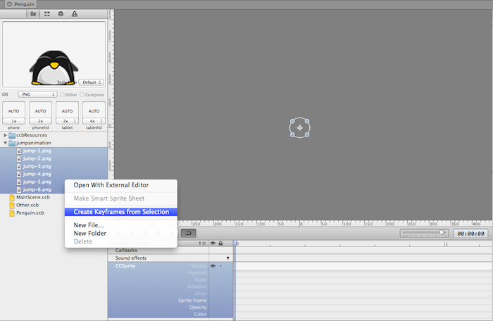
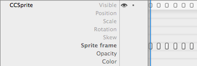
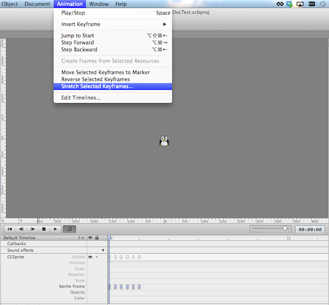

#Sprite frame animations with SpriteBuilder

SpriteBuilder has a very simple approach for creating sprite frame animations with the SpriteBuilder timeline.

> Note: If you are unfamiliar with the SpriteBuilder timeline you might want to read **Basics of SpriteBuilder: SpriteBuilder's Timeline** first

##Add Resources
The animation frames need to be added to the SpriteBuilder project by dragging the resource folder into the left pane.

##Create a new Sprite ccb file
A new Sprite ccb file is needed to apply the animation.

##Create keyframes
SpriteBuilder can automatically create keyframes from a set of images:

- Select the sprite to which the animation shall be applied to
- Select the images that shall be part of the animation
- Right click and select *Create Keyframes from Selection*

This will add the keyframes to the timeline:

##Changing the animation speed

The individual keyframes can be dragged around to change the speed of the animation. Additionally SpriteBuilder provides a convenient functionality that allows to stretch selected keyframes. You need to select all the keyframes that shall be affected and choose *Animation > Stretch Selected Keyframes...*:

> Note: If this step does not work for you, you are a affected by a [SpriteBuilder bug](http://forum.spritebuilder.com/t/sprite-frame-animation-cant-be-selected/286). You can apply the workaround mentioned on the forum.

##Run the animation in code
If you do not want to autoplay the animation (animation starts as soon as node enters the stage) you need to deactivate autoplay, by selecting *Animation > Edit Timelines...* from the top menu and uncheck the the *autplay* option for your timeline:

You may also want to rename your timeline to make it easier to access it in code and adjust the timeline duration to fit your animation. 

To run the animation in code, set a custom class for the sprite that shall be animated.
Within that custom class you can access the animation manager and run the animation:

	- (void)runAnimation
	{
  		// the animation manager of each node is stored in the 'userObject' property
   		CCBAnimationManager* animationManager = self.userObject;
   		// timelines can be referenced and run by name
   		[animationManager runAnimationsForSequenceNamed:@"jump"];
	}

#See also

- Integrating a sprite frame animation into a game is also a part of our [*Getting started with SpriteBuilder tutorial*](https://www.makegameswith.us/tutorials/getting-started-with-spritebuilder/sprite-animation-spritebuilder/)
