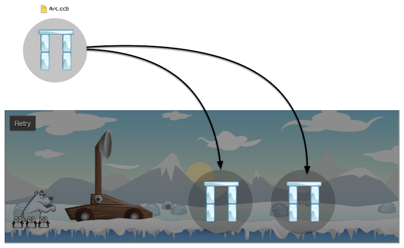

#Compose Scenes using Sub ccb files

In SpriteBuilder ccb files can be included in other ccb files. This makes it very easy to build compound objects and reuse them in a game. This feature is mostly very useful when building levels with SpriteBuilder.

A ccb file can be added to another one, either by adding a *Sub File* from the Node Library and selecting the desired ccb file, or by dragging the ccb file directly to the ccb file it shall be included in.

Typical use cases for sub ccb files:

- Composing levels using different compound objects
- Including characters with animations that are defined in their own ccb file
