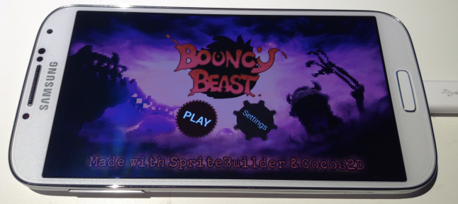

# Android Development

SpriteBuilder and Cocos2D can be used to build, run, and deploy apps on Android devices. The cross-compiling technology provided by [Apportable](http://www.apportable.com/) enables you to run Objective-C apps on Android devices at native speed without having to write any Java or C++ code.

This section outlines what you need to know if you plan on developing for Android devices or consider to port an existing iOS app.

