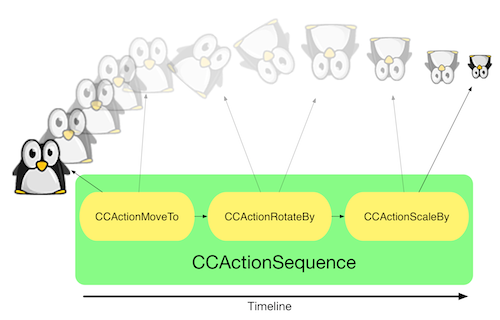

#Cocos2D Action System

Cocos2D provides a sophisticated action system to define animations and movements in code. The base class for Cocos2D actions is `CCAction`. Cocos2D includes a huge amount of `CCAction` subclasses. The best overview is available in the [hierarchy view of the API Docs](http://www.cocos2d-iphone.org/api-ref/3.0-rc1/hierarchy.html).

##Basic Action concepts

Each `CCAction` has a *target*. The `CCAction` manipulates different properties of its *target*, for example to move a `CCNode` over the screen.

Setting up a simple action:

	CCActionMoveTo *moveTo = [CCActionMoveTo actionWithDuration:1.f position:ccp(50, 100)];
    [hero runAction:moveTo];
    
By calling `runAction:` on a `CCNode` and passing an *action* along you make the node the target of that action. In case of the example above, the hero will move to the target position within 1 second. 

##Wrapping and Grouping Actions

Many actions in Cocos2D wrap around other actions and manipulate them, group them or sequence them. Examples:

- **CCActionReverse**: Reverses another action
- **CCActionSequence**: Runs multiple actions after each other

##Finite, Instant, and Infinite actions

###Finite Actions

All subclasses of `CCFiniteAction`. Can either be `CCActionInterval` actions or `CCActionInstant` actions. Some examples:

- CCActionMoveTo (interval)
- CCActionHide (instant)

###Infinite Actions

Subclasses of `CCAction`:

- CCActionFollow
- CCActionRepeatForever
- CCActionSpeed

In certain cases it is important if finite or infinite actions are used. For example `CCActionReverse` can only take a finite action as a parameter since only actions that have a start and an endpoint can be reversed. `CCActionSequence` is another example for a wrapper action that can only take finite actions.

##Running code from actions

Cocos2D provides two actions that allow running code:

- CCActionCallFunc (uses selectors)
- CCActionCallBlock (uses blocks)

Most developers use this kinds of actions within a sequence. A common pattern is having a `CCActionSequence` and adding a `CCActionCallFunc` or `CCActionCallBlock` as the last action. This pattern provides a callback for a `CCActionSequence`.