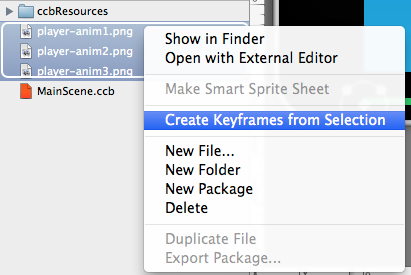
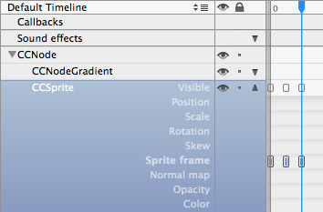

# SpriteFrame Animations

## Creating SpriteFrame Animations in SpriteBuilder

Creating SpriteFrame Animations is very simple in SpriteBuilder:

- Import the animation images into SpriteBuilder
- Open the stage and select the sprite you want to animate
- Select all the animation images in the File View
- Right-click and select *Create Keyframes from Selection* to add the spriteframe keyframes to the selected sprite

You'll see a corresponding number of keyframes have been added to the selected sprite, all equally spaced. If you want to alter the animation's playback speed.

<table border="0"><tr><td width="48px" bgcolor="#d0ffd0"><strong>Tip</strong></td><td bgcolor="#d0ffd0">
If this won't work, double-check that the desired sprite is currently selected when you run the *Create Keyframes from Selection* command and that the selected node is indeed a Sprite node.
</td></tr></table>
