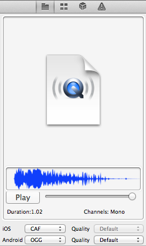
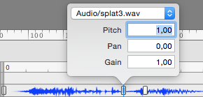

# Working with Audio in SpriteBuilder

SpriteBuilder can manage, convert and publish audio files for you in formats suitable to all supported platforms.

## Importing Audio Files

To import audio files, you just drag & drop one or more audio files from Finder onto SpriteBuilder's File View. Note that SpriteBuilder currently **only accepts WAV audio files** but this may be expanded to include CAF, MP3 and M4A [in the future](https://github.com/spritebuilder/SpriteBuilder/issues/1349).

### Converting Audio Files before Import

If your audio files are not in the correct format you need to convert them first. 

A simple yet powerful tool is [SoundConverter](http://soundconverter.en.softonic.com/mac) which is also available in some regions [on the Mac App Store](https://itunes.apple.com/us/app/soundconverter/id413890028). A similarly powerful batch converter for audio files is [xACT](http://www.macupdate.com/app/mac/14246/xact).

A more versatile and free audio editor is [Audacity](http://audacity.sourceforge.net/) which does more than just converting sounds, but it is not particularly suited to *just converting a bunch of audio files*.

## Audio Preview

When a audio file is selected in the File View, you'll see something like the following in the Preview area:

From the Preview area you can play back the audio and see the audio file's waveform, its duration (in seconds) and the channels used (mono or stereo).

For iOS SpriteBuilder will automatically pick a suitable output format, either CAF (.caf extension) or MP4 (.m4a extension), based on the length of the audio file. Audio files that play longer than 10-20 seconds are typically best published in the compressed audio format MP4 while short sound effects should be using CAF.

For Android the output format is always OGG (.ogg extension).

The audio quality can be set in the range from 1 (lowest quality, smallest file size) to 8 (highest quality, largest file size). Using the *Default* setting will choose whatever audio quality setting is set to in the Project Settings dialog. What quality is acceptable and how file size changes depends on the audio file in question and needs to be determined through experimentation.

## Sound Effects Keyframes

How to create and edit audio keyframes is also explained in the [Keyframe Editor](./spritebuilder/keyframe-editor) article.

In summary:

- Hold down the `Option` key, then click anywhere on the *Sound Effects* row in the Keyframe Editor to create a sound effect keyframe.
- Double-click a *Sound Effects* keyframe to edit its properties: the audio file as well as Pitch, Pan and Gain.

<table border="0"><tr><td width="48px" bgcolor="#ffffc0"><strong>Note</strong></td><td bgcolor="#ffffc0">
*Sound Effects* keyframes are played through OALSimpleAudio's `playEffect` method, meaning playback uses OpenAL. This is good for (short) sound effects as the entire sound file will be buffered in memory, but this would be unsuitable for long audio, specifically when it's supposed to be streaming audio (M4A/MP3). Such audio should rather be played programmatically using the `playBg` methods of OALSimpleAudio.
</td></tr></table>