# Cocos2D Nodes

A quick overview of the available nodes in Cocos2D.

## Base Classes

CCNode inherits from [**CCResponder**](http://www.cocos2d-swift.org/docs/api/Classes/CCResponder.html). CCResponder provides touch and other input handling.

All other nodes inherit from CCNode. Thus the CCResponder functionality is available to all nodes.

## Important Node Properties

The most commonly used node properties and their purpose, in alphabetical order.

- `anchorPointInPoints` Factor (default: {0.5, 0.5} or {0.0, 0.0} depending on node class) that determines point of origin for scale and rotation. Also affects where content (texture) is drawn relative to node's position. Can be used to quickly top/bottom/left/right/center align a node's contents. Avoid using it solely as a position modifier.
- `contentSizeInPoint` The size (in points) of the node's content rectangle. Is {0,0} for container nodes. Does not consider the contentSize of its child nodes.
- `name` Used to identify a node. Use unique names if you need to uniquely identify nodes.
- `paused` If YES, the node pauses its actions and scheduled selectors/blocks. Child nodes are paused as well.
- `physicsBody` The node's physics body, if any. Create and assign a CCPhysicsBody if the node should be controlled by physics.
- `physicsNode` Returns the nearest CCPhysicsNode.
- `positionInPoints` The position (in points) of the node relative to its parent node's position.
- `rotation` The rotation (in degrees) of the node relative to its parent node's rotation.
- `scale` The node's scale (multiplier, defaults to 1.0) relative to its parent node's scale.
- `scene` Returns the CCScene instance that the node is a child of. Is `nil` until `onEnter` runs, so it can not be used during a node's init phase.
- `userObject` Can be used to store custom data in any node. Add a collection object to store any number and type of data in the node without having to subclass it.
- `visible` If YES, the node will be drawn. It is best practice to set visible to NO if you want to re-use the node since it is more efficient than allowing the node to deallocate and later creating a new one.
- `zOrder` Affects the draw order of the node relative to its siblings. Lower values mean the node will be drawn before (behind) nodes with higher zOrder, higher zOrder values will draw the node after (in front of) nodes with lower zOrder. If all child nodes of a parent node use the default zOrder of 0 the child nodes will be drawn according to the order they were added to the parent node.

## Container Nodes

These nodes do not draw anything themselves.

### [**CCNode**](http://www.cocos2d-swift.org/docs/api/Classes/CCNode.html)
Invisible node, mainly used to create "layers" or just to group other nodes logically in the editor. Can also be used as the anchor node for easier rotation of child nodes around a given point (the node's position).

### [**CCScene**](http://www.cocos2d-swift.org/docs/api/Classes/CCScene.html)
Contains all nodes in a scene. Can be presented, optionally with a transition animation.

### [**CCNodeMultiplexer**](http://www.cocos2d-swift.org/docs/api/Classes/CCNodeMultiplexer.html) 
Similar to CCNode except that only one of the child nodes will be active (drawn and updated). You can change the active node at runtime.

### [**CCParallaxNode**](http://www.cocos2d-swift.org/docs/api/Classes/CCParallaxNode.html) 
Moves its child nodes at varying speeds based on a parallax factor.

### [**CCPhysicsNode**](http://www.cocos2d-swift.org/docs/api/Classes/CCPhysicsNode.html)

Enables physics for child nodes that have a physics body. Only nodes whose parent (or grand..parent) is a CCPhysicsNode will take part in the physics simulation. You can change the world's gravity, enable physics debug drawing and set the collision callback delegate object via the CCPhysicsNode.

## Draw Nodes

These nodes draw basic content like colored rectangles, geometry and images.

### [**CCDrawNode**](http://www.cocos2d-swift.org/docs/api/Classes/CCDrawNode.html) 
Draws primitives like dots, lines, polygons with fill and border (stroke) color. Changing a primitive requires clearing the entire draw node and submitting all primitives again. It is most useful for debug drawing. 

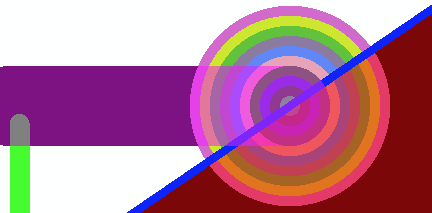

### [**CCNodeColor**](http://www.cocos2d-swift.org/docs/api/Classes/CCNodeColor.html)

Draws a rectangle filled with a solid color. 

<table border="0"><tr><td width="48px" bgcolor="#d0ffd0"><strong>Tip</strong></td><td bgcolor="#d0ffd0">
If you need to draw a rectangle with a solid color prefer to use CCNodeColor over CCSprite as it uses very little memory (no texture).
</td></tr></table>

### [**CCNodeGradient**](http://www.cocos2d-swift.org/docs/api/Classes/CCNodeGradient.html)

Draws a rectangle filled with a gradient. You can specify start and end colors and the direction of the gradient.

<table border="0"><tr><td width="48px" bgcolor="#d0ffd0"><strong>Tip</strong></td><td bgcolor="#d0ffd0">
If you need to draw a gradient prefer to use CCNodeGradient over CCSprite with a gradient image as CCNodeGradient uses very little memory (no texture).
</td></tr></table>

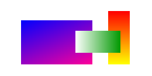

### [**CCRenderTexture**](http://www.cocos2d-swift.org/docs/api/Classes/CCRenderTexture.html)

Creates a texture containing the nodes drawn onto the render texture. The created texture can then be used as input for a sprite or saved as image to disk. Commonly used to create screenshots of a scene or a branch of the scene's node tree.

### [**CCSprite**](http://www.cocos2d-swift.org/docs/api/Classes/CCSprite.html)

Draws an image on the screen. The image can be drawn with color (tinting), skewed, semi-transparent and other effects. CCSprite is likely the single most frequently used node. Theoretically you can build almost any game entirely out of sprites, though other nodes may be more efficient (CCNodeColor, CCNodeGradient) or maintainable (CCLabelTTF, CCLabelBMFont) depending on the situation.

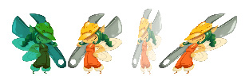

### [**CCSprite9Slice**](http://www.cocos2d-swift.org/docs/api/Classes/CCSprite9Slice.html)

Essentially a sprite which divides its image into 9 areas, hence the name. The border areas are drawn unscaled while the center area is stretched (scaled) to match the desired content size. Used to create user interface frames that need to be able to stretch with the content without the frame borders becoming blurred or aliased. CCSprite9Slice is used internally by the user interface nodes like CCButton.

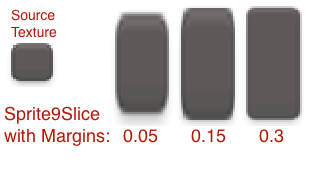

### [**CCTiledMap**](http://www.cocos2d-swift.org/docs/api/Classes/CCTiledMap.html)

Renders tilemaps loaded from a TMX file. It can draw orthogonal, isometric and hexagonal tilemaps. A popular tilemap editor is [Tiled](http://www.mapeditor.org).

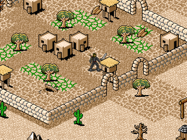
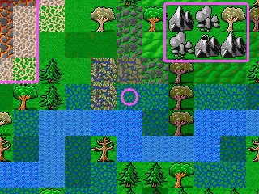

## Visual Effect Nodes

These nodes create a variety of visual effects, either by themselves or in combination with other nodes.

### [**CCClippingNode**](http://www.cocos2d-swift.org/docs/api/Classes/CCClippingNode.html)

The clipping node can use any node as stencil, so that only the stencil node's area is drawn or, if the effect is inverted, see-through.

<table border="0"><tr><td width="48px" bgcolor="#d0f0ff"><strong>Info</strong></td><td bgcolor="#d0f0ff">
Consider that some uses of a clipping node can be equivalent to drawing one or more images over the scene or area. For instance enclosing the scene's content in a window frame or HUD with an irregular shape does not require a clipping node.
</td></tr></table>

### [**CCMotionStreak**](http://www.cocos2d-swift.org/docs/api/Classes/CCMotionStreak.html)

Used to draw a line that gradually fades out. Can be used as a touch & drag indicator.

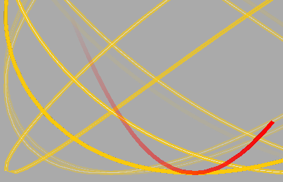

### [**CCParticleSystem**](http://www.cocos2d-swift.org/docs/api/Classes/CCParticleSystem.html)

A particle emitter that creates a stream of particles. Particles are like tiny sprites, but can be drawn faster than the same number of sprites. You can modify the particle emitter's parameters to change the animation. You can not access or modify individual particles at runtime and they can not have physics bodies either.

<table border="0"><tr><td width="48px" bgcolor="#ffd0d0"><strong>Caution</strong></td><td bgcolor="#ffd0d0">
Aim for the lowest possible number of particles for best performance. Particle effects with a particle count of several hundred particles should be avoided or limited to only one or two of them drawn at the same time.
</td></tr></table>

<table border="0"><tr><td width="48px" bgcolor="#d0ffd0"><strong>Tip</strong></td><td bgcolor="#d0ffd0">
You can draw multiple particle effects on top of each other to create more versatile effects with different textures, colors and behavior while still keeping the total particle count relatively low.
</td></tr></table>

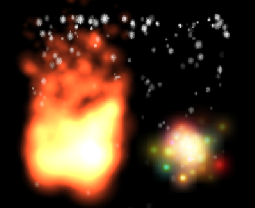

### [**CCProgressNode**](http://www.cocos2d-swift.org/docs/api/Classes/CCProgressNode.html)

A sprite that can be animated given a completion percentage. The sprite will gradually fill or reveal another sprite. This can be used for loading bars and cooldown timers. 

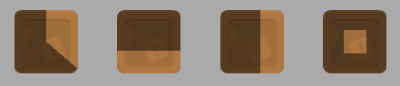

## Label Nodes

Cocos2D can draw two sorts of labels: bitmap font and truetype font. Their main differences are summarized in this table:

&nbsp; | Bitmap Font Label | TrueType Font Label
- | - | -
**Glyphs** | Images | Vector Data
**Font Size** | Set when creating the font, can not be modified at runtime. | Can be modified at runtime.
**Scaling** | Via scale property, natural loss in image quality due to scaling artifacts (blur/pixelation or aliasing). | By changing font size, no loss in quality.
**Effects** | Outline, shadow and other effects baked into texture when creating the font. | Outline and shadow can be added at runtime at the expense of even greater text change cost. Also supports attributed strings.
**Rendering Performance** | Comparable to Sprites | Comparable to Sprites
**Text Change Performance** | Fast: texture with glyphs already in memory. | Slow: old texture discarded, new texture created using iOS font rendering framework.
**Memory Usage** | Size of glyph texture atlas. | Each label creates its own texture.
**Available Fonts** | Must be created with an external tool and bundled with the app. | Built-in truetype fonts (see [iOS font list](http://iosfonts.com/)) plus any custom Truetype font added to app bundle. Custom fonts must be registered in Info.plist ([see this Q&A](http://stackoverflow.com/questions/4228644/using-custom-fonts-in-cocos2d)).

**Bitmap Font Labels**: 

- Use if you frequently change label text, even if you have just one label whose text changes every frame (ie score, timer) because updating a truetype label's text is very costly.
- Use if you have many labels using the same font or very few fonts. Uses less memory than Truetype font labels.
- Use if you want a completely custom font made of individual images (see example below).

**Truetype Font Labels:**

- Use if you only need a few labels or for debugging purposes.
- Use if you need to be able to scale labels at runtime without loss in quality/readability.
- Use if you need a label to be able to change to other truetype fonts at runtime.
- Use for static menu text, or where you can create variants of labels up-front so you merely need to change their visible state rather than updating the label text. Updating the text is very slow for Truetype font labels.
- Use if you need to use attributed strings, or modify the shadow and outline effects at runtime.

### [**CCLabelBMFont**](http://www.cocos2d-swift.org/docs/api/Classes/CCLabelBMFont.html) 

Draws bitmap fonts. In a bitmap font each character is represented by an image. Bitmap font tools with support for SpriteBuilder & Cocos2D are:

- [bmGlyph](http://www.bmglyph.com/)
- [Glyph Designer](https://71squared.com/glyphdesigner)

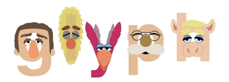

### [**CCLabelTTF**](http://www.cocos2d-swift.org/docs/api/Classes/CCLabelTTF.html)

Draws truetype font labels. Each label has its own texture. Every label text change causes the old texture to be discarded and a new texture is created, meaning: are **text changes of truetype labels are very costly**! 

TTF Labels support attributed strings (iOS 6+) and custom Truetype fonts. Outline and shadow effects can also be added, further increasing the cost of text changes.

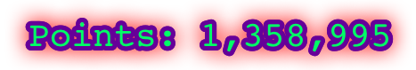

## User Interface Nodes

The base class for all User Interface nodes is [CCControl](http://www.cocos2d-swift.org/docs/api/Classes/CCControl.html).

### [**CCButton**](http://www.cocos2d-swift.org/docs/api/Classes/CCButton.html)

A button with a background image (CCSprite9Slice) and a label (CCLabelTTF). When clicked/tapped the button will run a block or selector. The background image and label properties can be modified just like margins and alignment. You can even create buttons with no background nor label (invisible button) and adjust the button's size to a rectangle with custom content that should react to taps/clicks.

### [**CCLayoutBox**](http://www.cocos2d-swift.org/docs/api/Classes/CCLayoutBox.html)

Aligns its child nodes either vertically or horizontally. A CCLayoutBox added to another CCLayoutBox with different orientation (one vertical, the other horizontal) enables you to align nodes in a grid.

<table border="0"><tr><td width="48px" bgcolor="#ffffc0"><strong>Note</strong></td><td bgcolor="#ffffc0">
CCLayoutBox is not suitable for rendering tilemaps. Use CCTiledMap or a number of CCSprite nodes programmatically aligned to a grid.
</td></tr></table>

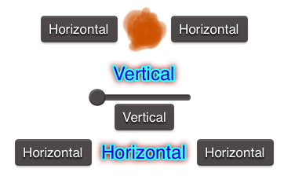

### [**CCSlider**](http://www.cocos2d-swift.org/docs/api/Classes/CCSlider.html)

Draws a slider control which runs a selector or block every time the slider value changes. The slider's background and handle images can be customized. To create vertical sliders simply rotate the slider by 90 or 270 degrees.

### [**CCTextField**](http://www.cocos2d-swift.org/docs/api/Classes/CCTextField.html)

Provides a text field for text input. The text field is actually a UITextField/NSTextField with a frame image (CCSprite). Due to the Cocoa (Touch) text field this node should not be scaled, skewed, rotated or it might not draw correctly.

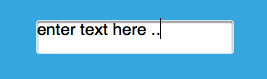
