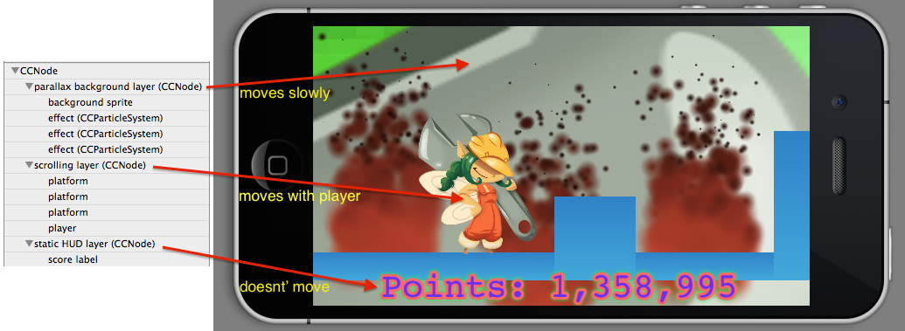

# Scenes and Layers

In this article you will learn the lifecycle and layout of a Cocos2D scene.

## Scenes

Scenes are containers for replacable content (nodes) in a Cocos2D view. Whenever you need to swap in or out an entire hierarchy, scenes are often the way to go. Cocos2D scenes can be thought of as the equivalent to Storyboards scenes.

A scene contains a hierarchy of nodes which draw their contents on the screen. Scenes are presented within the Cocos2D view. Only one scene at a time can be presented and animated.

The nodes within a scene are not limited to the size of the view. This allows you to create scrolling levels with some nodes partially or entirely drawn outside the bounds of the view.

Scenes inherit from `CCNode` and have no additional properties or behavior over `CCNode`. Scenes usually take on the role as the view controller (or rather: node controller) for a given scene and its nodes. 

<table border="0"><tr><td width="48px" bgcolor="#d0ffd0"><strong>Tip</strong></td><td bgcolor="#d0ffd0">
It is recommended to not change a scene's properties, for instance changing the scene's position to create a scrolling effect. Instead use the layering concept below to create layers that can be moved or otherwise animated at varying speeds.
</td></tr></table>

## Subclassing

In pure Cocos2D apps it is customary to subclass `CCScene`. In SpriteBuilder apps you usually don't work with scenes at all but instead you will have custom subclasses of `CCNode` added to a generic scene object.

### Scene Lifecycle

A scene instance is instantiated, then presented in the Cocos2D view. The scene remains presented until another view is presented, which replaces the existing scene, or the app is terminated. The `CCDirector` class is responsible for presenting scenes.

Scenes can also be pushed onto another scene, and later popped. This enables you to temporarily present a scene on top of the current scene, without the current scene deallocating. However due to the added memory usage (two or more scenes remain in memory) pushing and popping scenes is not commonly used. The same effect can be achieved by adding and removing layers (see below) while the presented scene continues to animate.

The following diagram illustrates the scene flow for a very basic game that starts with a Menu Scene. If the user taps the Play button on the Menu scene, the game transitions to the Gameplay scene, loading resources as needed. If the user then taps the Store button, the game may present the ingame Store menu either by pushing the Store scene on top of the Gameplay scene or simply by adding the Store content layer while also pausing the game. At any time the player can quit the game which will present the Menu Scene again.

### Scene Memory Management

Once a scene is no longer presented, and there aren't any strong references holding on to it, it will deallocate and remove all of its nodes, unscheduled its selectors, stop running actions. Basically whatever you add to a scene and its nodes will deallocate along with the scene.

Certain assets, such as textures, that have already been loaded into memory by means of creating Cocos2D nodes may be cached by Cocos2D and will remain available in the next scene, provided there is enough free memory.

### Scene Transitions

Replacing scenes can be animated with a transition, for instance a cross-fade or moving the new scene in from one side. Transitions are the Cocos2D equivalent of Storyboards segues.

If the new scene takes a long time to initialize (ie loading many assets), the transition will start animating only after the new scene has been created. Thus transitions are unsuitable for such instances. Rather you should present a more or less empty scene (loading scene), load the resources in the loading scene, then present the new scene.

If a transition is used to animate a scene change, both scenes remain in memory until the animation finishes. Both scenes are paused during the transition period.

<table border="0"><tr><td width="48px" bgcolor="#ffffc0"><strong>Note</strong></td><td bgcolor="#ffffc0">
Scene transitions should be fast and consistent. For instance if the level scene moves in from the right, it should leave the screen to the right as well. Using a large variety of transitions may come across as "cheap" or careless. It's best to decide on a certain style of transition (moving, pushing, fading) and use that exclusively.
</td></tr></table>

## Layers

In Cocos2D you can have any number of nodes with any number of child nodes. Certain properties of views are relative to their parent view's properties respectively inherited from the parent view. Properties like position and rotation are relative to the parent node's position and rotation. Other properties are simply inherited from the parent node, scale for instance.

In Cocos2D the term "layer" refers to a concept of grouping nodes together in the same parent node. You can then move and rotate the parent node, and all of its child nodes will follow suit. That way you can create multiple layers of nodes which move at different speeds or not at all.

<table border="0"><tr><td width="48px" bgcolor="#d0f0ff"><strong>Info</strong></td><td bgcolor="#d0f0ff">
Unlike in earlier Cocos2D versions there is no particular "CCLayer" class. Most often CCNode is used as an invisible container node in order to group nodes and to create said layers.
</td></tr></table>
