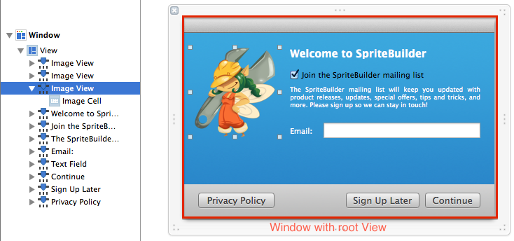
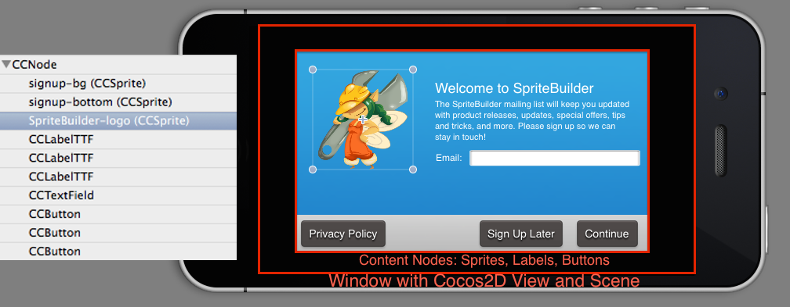

# Cocos2D Overview

Cocos2D renders its contents (called *nodes*) in a hierarchy similar to how Cocoa (Touch) renders its views. There are important differences between the two. In particular if you've been working with Cocoa (Touch) before you should read this article to learn about and understand these differences.

## Conceptual Differences at a Glance

&nbsp; | Cocos2D | Cocoa (Touch)
:- | :- | :-
**Purpose** | Optimized for animated, highly visual apps (games); High power consumption | Optimized for static views to conserve battery power; Inefficient for games
**Root Window** | `UIWindow` or `NSWindow` | `UIWindow` or `NSWindow`
**Root View** | Cocos2D View | Any `UIView` or `NSView`
**MVC** | CCDirector is the Cocos2D `UIViewController` on iOS. Within a scene the node subclasses are typically view, view controller and model all in one. [Separation of concerns](http://en.wikipedia.org/wiki/Separation_of_concerns) is entirely up to the developer's discretion. | Typically `UIViewController` / `NSViewController` subclasses.
**Hierarchy** | Tree of Nodes | Tree of Views
**Exclusive** | The Cocos2D View can have `UIView`/`NSView` subviews. Scene and Nodes can not have subviews, just child nodes. | `UIView`/`NSView` can have a single Cocos2D view as a subview. They can not have Scenes or Nodes as subviews.
**Draw Order** | Order in Hierarchy, `zOrder` property | Order in Hierarchy
**Rendering** | OpenGL or Metal, entire screen drawn every frame | Internal (OpenGL), only areas marked as "dirty" are re-drawn
**Coordinate System** | Origin (0,0) in lower-left corner, positive Y extends upwards | Origin (0,0) in upper-left corner, positive Y extends downwards
**Updates** | Render Loop, Scheduled selectors/blocks, Selector/Block Action with Delay Action | Event-Based, Delegation, Timers
**Animation** | Actions, manual property changes over time | `UIAnimation` / `NSAnimation`

<table border="0"><tr><td width="48px" bgcolor="#ffffc0"><strong>Note</strong></td><td bgcolor="#ffffc0">
Mixing Cocoa (Touch) views with a Cocos2D view is possible. But all nodes drawn by Cocos2D can only be reordered in the Cocoa (Touch) view hierarchy as a whole, by reordering the Cocos2D view itself. It is technically impossible to draw some nodes "outside" of the Cocos2D view. For instance you can't add Cocos2D sprites as cells to a table view, nor can you have Cocoa (Touch) views drawn "sandwiched" between two layers of nodes.
</td></tr></table>

## It all starts with a Window

Both on iOS and OS X there will be a window (`UIWindow`/`NSWindow`) object that contains the application's views.

In a regular Cocoa (Touch) app, the application is built by adding views (`UIView`/`NSView`) to the window, and adding more views to other views. The app window is a hierarchy of views. The draw order of views is determined by their place in the view hierarchy.

The following screenshot depicts a Cocoa window with a view containing other views (`NSImageView`, `NSTextField`, `NSButton`).

In a Cocos2D app, you usually only have a single view: the Cocos2D view. It renders its contents using OpenGL (`CCGLView`) or Metal (`CCMetalView`). On iOS the Cocos2D view is a subclass of `UIView`, on OS X it is a subclass of `NSOpenGLView`. 

The Cocos2D view presents a single scene (`CCScene`) which contains a hierarchy of nodes (sprites, labels, effects, etc). All nodes inherit from `CCResponder` which inherits from `NSObject` - meaning: nodes are not views themselves, they can only be drawn within the Cocos2D view. The draw order of nodes is determined by their order in the hierarchy, but can be overridden to some degree via a node's `zOrder` property.

The following screenshot is a very similar layout to the view above, except this one was created within a Cocos2D view using nodes (`CCSprite`, `CCLabelTTF`, `CCTextField`, `CCButton`).

Conceptually the Cocos2D node hierarchy with scenes and nodes is not very different from the Cocoa (Touch) view hierarchy. Except that the two hierarchies are completely separated. Nodes only work inside the Cocos2D view, and there can be only one Cocos2D view at a time.