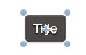

#Code Connections in SpriteBuilder

Code connections are a powerful feature of SpriteBuilder. They are used to add custom code to scenes and nodes created in SpriteBuilder.

##Custom Classes

In the right panel you can set a custom class for any node:

Any node added in SpriteBuilder can be backed by a custom class. When a `CCNode` with a custom class gets displayed in the scene, the custom class is instantiated. Cocos2D calls `didLoadFromCCB` on any custom class, as soon as the corresponding node and all the children have been loaded completely.

> Note: It is important that the custom class is a subclass of the node type you chose in SpriteBuilder. For example: You create a hero in SpriteBuilder which is a `CCSprite`. You want to create a custom class for that hero. It needs to be a subclass of `CCSprite`.

###Common use cases for custom classes

####Custom classes for scenes
A developer will use custom classes for almost every scene in his game. One simple example is activating touch handling on a gameplay scene:

- Create a Gameplay scene in SpriteBuilder
- Create a Gameplay class in Xcode, it needs to be a subclass of `CCNode`
- In SpriteBuilder set the custom class of Gameplay to `Gameplay`
- In `Gameplay.m` implement `didLoadFromCCB`
- In `didLoadFromCCB` call `self.userInteractionEnabled = TRUE`

####Custom classes for game objects
Most games will create custom classes for heroes or enemies. For example a developer could create an enemy with a certain movement pattern. 

- Create an Enemy Sprite in SpriteBuilder
- Create a Enemy class in Xcode, it needs to be a subclass of `CCSprite`
- In SpriteBuilder set the custom class of Enemy to `Enemy` 
- In `Gameplay.m` create and apply a `CCAction` in the `init` method

##Connecting member variables

A second way to connect SpriteBuilder and code is creating member variable connections. This allows a developer to access SpriteBuilder nodes from code. This, for example, can be useful to update the text displayed in a score label from code.

There a two different types of member variable connections. You need to select the node for which you want to create a code connection.

###Document Root connections

When *Doc root var* is selected in the member variable connection dropdown, SpriteBuilder will create a code connection with the *Document root*. The *Document root* is the root node of the current scene. When you choose this type of connection you need to fulfil two requirements:

- The *Document root* needs to have a custom class. If the score label is in your *Gameplay* scene you need to select the root *CCNode* of your *Gameplay* scene and set a custom class
- In the custom class that you set up you need to either add a property called *scoreLabel* or member variable called *_scoreLabel*.

When the *CCBReader* loads this scene with the code connection it will automatically assign a reference to the label you selected and store it in the *scoreLabel* property or *_scoreLabel* member variable. 

> Note: If you are using sub ccb files you need to be aware when using code connections.  Specifying the root node as target will refer to the root node of the sub ccb file, not to the root node of the scene the sub ccb file has been added to.

###Owner connections

When *Owner var* is selected in the member variable connection dropdown, SpriteBuilder will create a code connection with the *Owner* of this node. The owner can be defined at runtime when the node is loaded in code, using one of the following two methods (depending if a node or a scene is loaded):

	CCScene *scene = [CCBReader loadAsScene:@"MyScene" owner:myObject];
    CCNode *node = [CCBReader load:@"MyNode" owner:myObject];
    
Requirements:

- The owner class needs either a property called *scoreLabel* or member variable called *_scoreLabel*.

Use the owner connection if you need to decide which class will be connected to the node at runtime.

> Note: The loaded node/scene does not maintain a strong reference to the `owner`. You need to retain the `owner` manually.

##Connecting callbacks for interactive elements
SpriteBuilder and Cocos2D provide a couple of interactive UI elements out of the box, e.g. buttons or sliders. A developer can setup callback methods that shall be called when actions on these UI elements occur. 

Just as the member variable connections the callbacks can be either linked to the *Document Root* or to the *Owner*. 

###Basic callback

This basic callback example uses a *Button*. Selecting a *Button* on the stage will cause a new section called *CCControl* to appear in the right panel.

- The method name can be entered in the *selector* field
- The corresponding class (either the *Document Root* or the *Owner*) need to implement a method with that name

In this example the `play` method on the *Owner* will be called once the button is touched. Since the selector name is `play` the method implementation should have no parameters:

    - (void)play {
        CCLOG(@"play");
    }

###Passing the sender to the callback method
For some UI components it makes sense to pass the sender (the UI component on which the event ocurred) into the callback method. E.g. when using a slider a developer will often want to access the current value of the slider after it changed.

If the sender shall be contained as a parameter the selector needs to contain a colon:

If the selector contains a colon the implemented callback needs to take one parameter. The type can be either `id` or the type of the actual control, e.g. `CCSlider`.

    - (void)valueChanged:(CCSlider *)slider {
        CCLOG(@"%f", slider.sliderValue);
    }
    
###Using the continuous option

This option is applicable to UI components that change their value gradually, for example a `CCSlider`. If *Continous* is checked the callback will be called every time the value gets changed. If *Continous* is not checked the callback is only called when the user stops interacting with the slider and the slider stops in the final position.