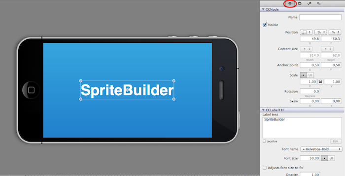
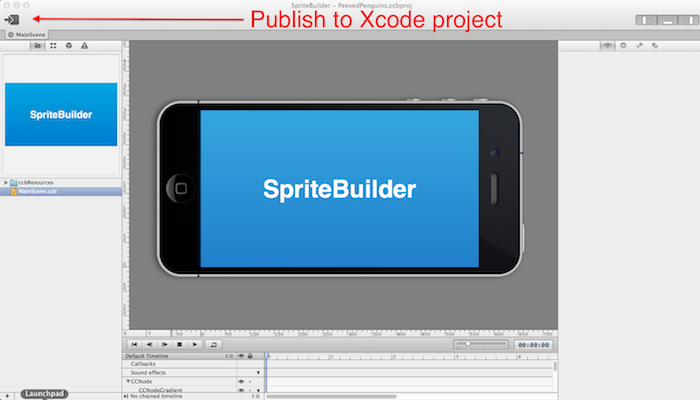

#The SpriteBuilder User Interface

This chapter will provide a tour of SpriteBuilder's User Interface. At first sight, SpriteBuilder's UI feels quite familiar - it uses many concepts from Xcode/Storyboard.

The interface is divided into 4 main sections:

1. **Resource/Component Browser:** Provides a list of different resources and scenes that have been created or added to the project. The component tab provides different types of Nodes that can be dragged to the scene.
2. **Stage:** The stage previews the current scene. Here all of the Nodes that belong to a scene can be arranged.
3. **Timeline:** The timeline is used to create animations within SpriteBuilder. It also provides an overview of the scene hierarchy.
4. **Detail View:** Once a node within the scene has been selected, this detail view will display a lot of editable information about that node. It allows developers to modify positions, content (the text of a label, for example) and physics properties.

##Details on different Views

###File View

The first tab in the resource/component browser (labelled as section 1 in the image above) represents the File View. It lists all the .ccb files and resources that have been added to a project:

In this view a developer can add new resources and restructure a project's folder hierarchy.

###Node Library

The third tab is the Node Library:

This panel shows all available node types a developer can use to construct gameplay scenes and menus.

###Tileless View

The second tab is called the tileless editor view:

The tileless editor view provides a quick visual overview of image assets and ccb files in a project.

###Inspector

The first tab of the Detail View (labelled as section 4 in the above image) is the Inspector. Once a node on the stage is selected this panel can be used to to modify many of its properties, like position and color:

The properties that affect position, scale, rotation and skew of the selected node can be edited visually in the canvas area. To move a node simply select it and drag it around, to change scale, rotation and skew manipulate the corners and edges of the node. To edit the anchor point of a node, grab it and drag it.

###Code Connections

The second tab on the right panel is used to manage code connections for selected node. One of the things that can be done here is setting custom Objective-C classes for a node:

###Publishing to Xcode

Using the button in the top left corner, publishes changes in the SpriteBuilder project to  Xcode. The SpriteBuilder project needs to be published before building the Xcode project:

