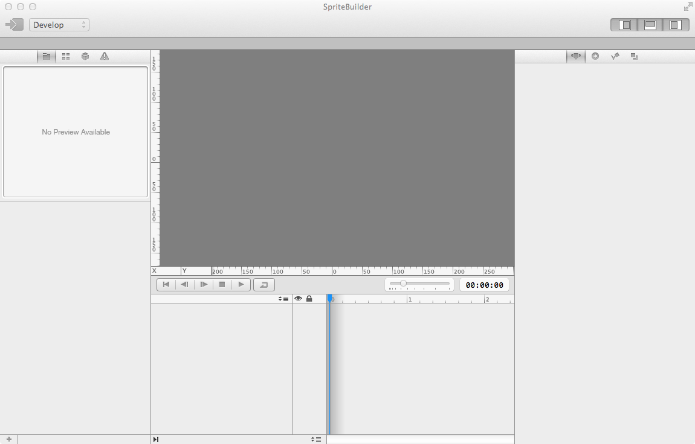
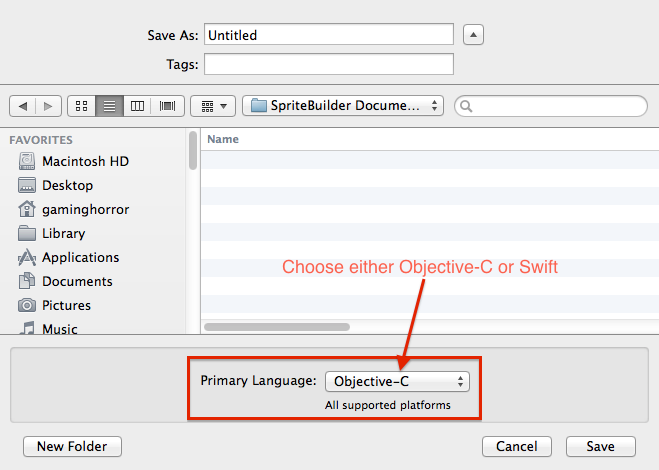
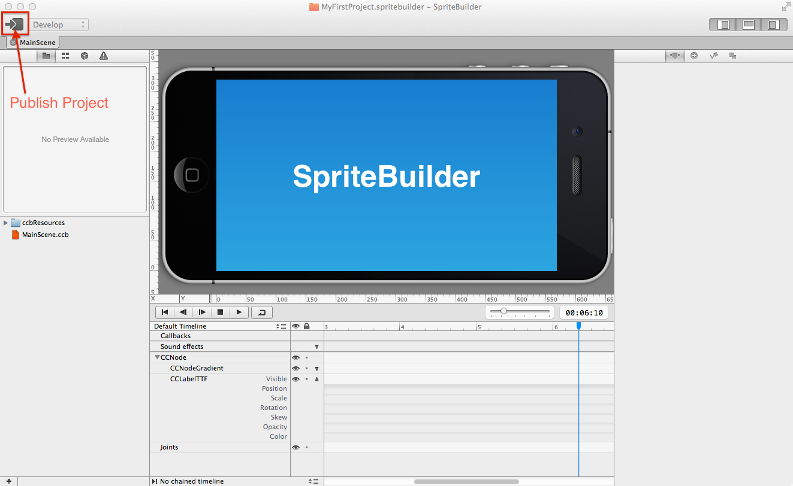
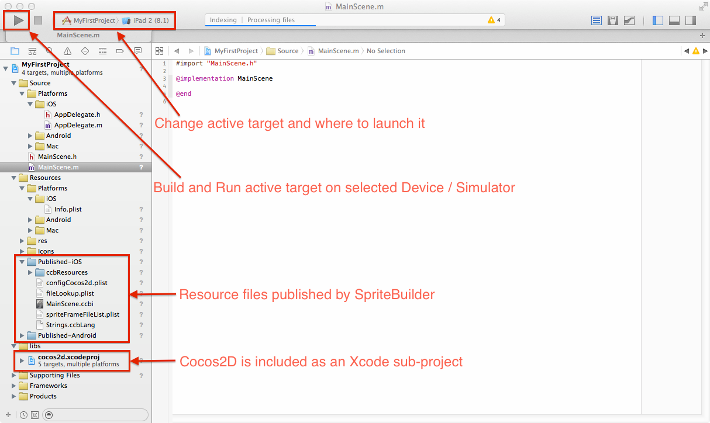
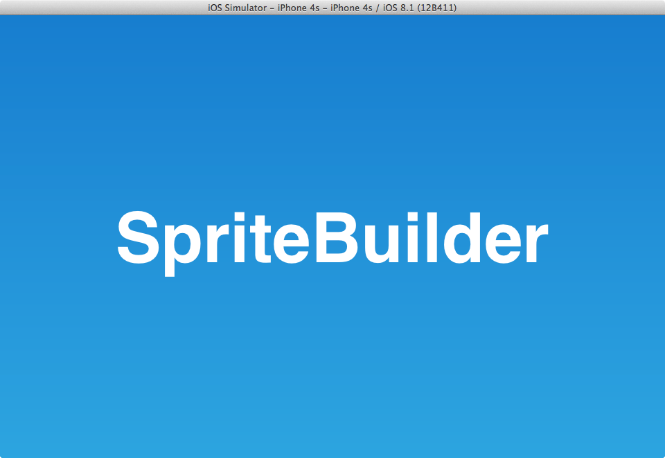

# First Steps with SpriteBuilder

## Installing SpriteBuilder

You can download SpriteBuilder for free from the [Mac App Store](https://itunes.apple.com/app/spritebuilder/id784912885). The latest beta versions are available on the [SpriteBuilder Beta download page](http://www.spritebuilder.com/beta). Experienced developers may want to [build SpriteBuilder from sources]().

There are no installation or setup steps necessary. Cocos2D-Swift is already included in the SpriteBuilder download.

## Launch SpriteBuilder

Launching the SpriteBuilder.app for the first time will show an empty SpriteBuilder window. It has no active project and therefore most of the User Interface is disabled.

## Create a New Project

In the SpriteBuilder Menu choose `File => New => Project...` to bring up the *New Project* dialog. Enter a name for your project and choose between Objective-C or Swift as your project's primary language.

<table border="0"><tr><td width="48px" bgcolor="#d0f0ff"><strong>Info</strong></td><td bgcolor="#d0f0ff">
Choosing language here only affects which language the initially created source files will use. You can always add Swift code to an Objective-C project or Objective-C code to a Swift project at a later time.
</td></tr></table>

Click Save when you have given your first project an appropriate name, for instance `MyFirstProject`.

<table border="0"><tr><td width="48px" bgcolor="#ffd0d0"><strong>Caution</strong></td><td bgcolor="#ffd0d0">
SpriteBuilder project names can only use letters and digits. You can not use spaces, punctuation and other characters in a SpriteBuilder project name. However this does not affect how you name your app on the App Store.
</td></tr></table>

## Publish the Project

The SpriteBuilder window will now show an almost empty project. To publish this project, click on the publish button in the upper left-hand corner. Publishing the project will copy and, if necessary, convert and compress resource files managed by SpriteBuilder to the accompanying Xcode project.

Once the project is published it is time to open the Xcode project.

## Open the Xcode Project

You can do so by choosing `File => Open Project in Xcode` from the menu, or press `Shift+Cmd+O`. If the Xcode project is already open, this command brings the corresponding Xcode window to the foreground.

## Build and Run

To build and run the project from Xcode click the `Run` button in the upper left corner. Next to it you can select the active build target and deployment location (iOS or Android device, iOS Simulator, OS X) which depends on the active build target.

If all went well the app should build without errors and launch on the selected deployment location.

