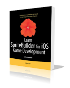

# Welcome to SpriteBuilder & Cocos2D Developer Guide

This is the developer guide for [SpriteBuilder](http://www.spritebuilder.com) and [Cocos2D-SpriteBuilder](http://http://cocos2d.spritebuilder.com), the **free and open source 2D game development** framework for **Objective-C** and **Swift** developers with support for **iOS, Android and OS X** platforms. Click on the logos below to open the corresponding websites.

Game Engine | Game Editor | Official Guide | Tutorials
:-: | :-: | :-: | :-:
 |  |  | 
Cocos2D-SpriteBuilder | SpriteBuilder | Learn SpriteBuilder | MakeSchool

Continue reading the [Documentation Overview](./getting-started/overview).

### SpriteBuilder Demos

<iframe width="568" height="320" src="//www.youtube-nocookie.com/embed/7dyj6NkM8Ew?rel=0&amp;showinfo=0" 
frameborder="0" allowfullscreen></iframe> 

<iframe width="480" height="360" src="https://www.youtube-nocookie.com/embed/eJsnCOkG8qs?rel=0" frameborder="0" allowfullscreen></iframe>

<iframe width="480" height="360" src="https://www.youtube-nocookie.com/embed/g5fCq8qJJQA?rel=0" frameborder="0" allowfullscreen></iframe>
