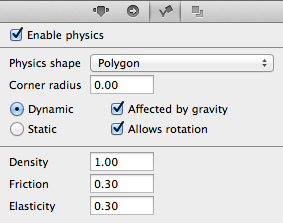
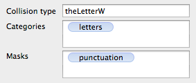

# Editing Physics Body Properties

Every node has the following physics properties.

## Common Properties

- **Enable Physics**: If checked, the node is controlled by physics. When the document is loaded, CCBReader will create an instance of `CCPhysicsBody` and assigns it to the node's `physicsBody` property.
- **Physics Shape** is either *Circle* or *Polygon*. The default radius for Circle bodies equals half the node's contentSize, while the default shape of the polygon is a rectangle whose size matches the node's bounding box.
- **Dynamic** means the body is controlled (exclusively) by the physics simulation. It can collide with other dynamic and static bodies if their collision categories and masks match. Dynamic bodies should not be moved/rotated through move/rotate actions, they can not animate their position and rotation properties via the Timeline. Instead dynamic bodies need to be moved by applying forces and impulses in code.
- **Static** bodies are immovable and do not generate collision events, though they provide collisions for dynamic bodies provided that their collision categories and masks match. Static bodies can be animated via the Timeline.
- **Affected by Gravity** is used to disable the effect of gravity on individual dynamic bodies.
- **Allows Rotation** is used to prevent a dynamic body from rotating.
- **Density** indirectly determine's the body's mass. Indirect because changing the area of the collision shape will also change the body's total mass. A bigger object weighs more than a smaller object if they have the same density. Value ranges from 0 to infinity. A game's main object(s) should have a density of 1 with all other body's densities adjusted relative to the main object(s).
- **Friction** determines how much speed two colliding bodies lose due to friction. Values in the range 0 to infinity, where 0 means no friction.
- **Elasticity** determines how much energy is conserved when two bodies collide. Values in the range 0 to 1, where 0 means (almost) all energy is dissipated and bodies come (nearly) at rest upon collision. A value of 1 means a perfect collision where the incoming speed equals the outgoing speed. Higher values cause the body to pick up speed (not recommended unless you artificially limit the body's maximum speed in code).

### Nodes Which Mustn't Have Physics Enabled

There are a few nodes which must not have *Enable Physics* checked:

- The **Physics Node** (`CCPhysicsNode`) instance itself. Enabling physics causes the physics world itself to "fall" under the influence of gravity, meaning gravity will be twice as strong. There may be other side-effects as well.

### Nodes Which Shouldn't Have Physics Enabled

There are a couple nodes where it makes little sense to have them under physics control, respectively where physics will not work as some developers expect they do.

- Any **Sub File** (`CCBFile`) node. Enabling physics has no effect on them.
- **Particle Systen** will only move the emitter as a whole. Individual particles are not treated as individual physics bodies, and before you ask: no, there's absolutely no way to do that unless you were to implement your own particle system using regular sprites as particles and account for the potentially huge hit on runtime performance.
- **Label Nodes** will move the entire label, but not individual letters. To have individual letters move as individual physics bodies you would need one label per letter.
- **Button**, **Text Field**, **Slider** and other GUI nodes: consider that having these under physics control may make it difficult, and under certain circumstances impossible for the user to interact with the controls. It may also be hard to read them.
- **Text Field** node must have its *Allows Rotation* property turned off. Text Field nodes do not support rotation.
- **Scroll View**: no guarantee can be made whether scroll views work correctly when under physics control.

## Collision Properties

- **Collision Type** determines the selector signature for collision callback methods and allows collision callback filtering. Must be a legal Objective-C variable name (ie must not use punctucation or spaces, name can't begin with a digit, etc).
- **Categories** determines one or more categories the body belongs to. If empty, the body will collide with any other body. If one or more category strings are set, the body only collides with other bodies whose Masks property contains at least one of the Categories strings.
- **Masks** determines which categories the body collides with. If empty, the body will collide with any other body regardless of that body's categories. If one or more mask strings are set, the body only collides with other bodies whose Categories property contains at least one of the Masks strings.

<table border="0"><tr><td width="48px" bgcolor="#ffffc0"><strong>Note</strong></td><td bgcolor="#ffffc0">
*Collision Type* does not affect when or whether a collision occurs and as such should not be confused with *Categories* and *Masks*. *Collision Type* only affects which collision callback methods get called and the order/names of parameters (see [Programming Physics](./physics/physics-programming)).
</td></tr></table>

The Categories and Masks fields are **comma-separated lists**. After you type a comma the preceding text will become a blue bubble text that you can no longer edit, only remove. Note that you can still select the bubbles and copy & paste them as regular text.

### How Collision Types change Collision Callback Signatures

The Collision Type determines the method signatures of the class implementing the [`CCPhysicsCollisionDelegate` protocol](http://www.cocos2d-swift.org/docs/api/Protocols/CCPhysicsCollisionDelegate.html).

For more information and examples see the [Programming Physics article](./physics/physics-programming).

### Collision Categories and Masks

Categories and Masks determine which bodies will collide with each other and which will pass through each other unhindered.

The default behavior is for bodies to have no string set for both Categories and Masks. This will have the body collide with any other body whose Masks property is empty.

The tricky part is to memorize that as soon as you enter a string in either the Categories or Masks field, collisions will only occur if two bodies have at least one of each other's Categories string in their Masks field. 

This also means that applying Categories and Masks **is only necessary if you need two bodies not collide with specific other bodies**. Otherwise you would just leave the Categories and Masks fields empty, and as a rule of thumb that is what you should always start with. Because you can only have 32 unique category/mask strings.

For example, if you have exactly one "player" and one "enemy" and for some reason you need to make sure they only collide with each other, nothing else, you would have to do the following:

&nbsp; | Player | Enemy
- | - | -
**Categories** | `player` | `enemy`
**Masks** | `enemy` | `player`

The collision filter test does a cross-examination. Only if the player's Categories list contains at least one matching entry in the enemy's Masks list **and** the enemy's Categories list contains at least one matching entry in the player's Masks list will a collision occur.
