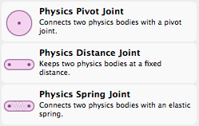
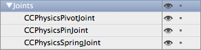
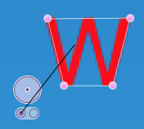
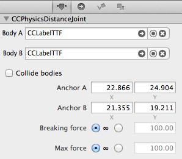
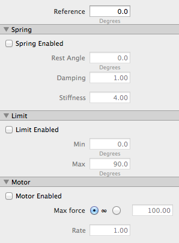
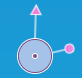
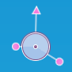
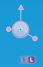
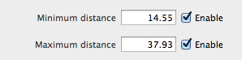
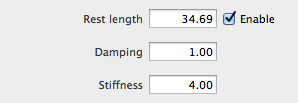

# Editing Physics Joints

Joints connect two bodies together so that they are connected. The type of joint and its properties determine the behavior of the connection.

## Joint Types

The following joint types are available in SpriteBuilder:

Joint Type | Description
- | - | -
**Pivot** | Both bodies rotate around a common pivot point.
**Distance** | Both bodies are kept at a fixed distance to each other. Sometimes referred to as "pin" joint.
**Spring** | Behaves like an elastic distance joint.

While these joints seem limited in variety, you can in fact combine them to form more complex joints.

## Adding Joints

To add a joint you just drag it from the Node Library View onto the Stage or Timeline. The joints in a SpriteBuilder document appear at the bottom of the Timeline's Node Tree, under the Joints entry.

## Connecting Bodies

Newly added joints have no connected bodies. An incomplete joint draws two circles beneath it, as in this example:

To make the connections you can use the Item Properties tab and select bodies via the Body A / Body B entries at the top. 

However you can more easily just start dragging a line out from an empty circle drawn below the joint, then drop the end of the line (attached to the mouse cursor) over the desired physics-enabled node on the stage. 

<table border="0"><tr><td width="48px" bgcolor="#d0ffd0"><strong>Tip</strong></td><td bgcolor="#d0ffd0">
If it proves difficult to highlight the desired body on the stage you can also drop the connection line over a physics-enabled node in the Timeline's Node Tree.
</td></tr></table>

## Joint Properties

### Common Properties

All joints share the same common properties, with the exception of the *Anchor B* which is not available for Pivot joints.

- **Body A/B**: The selected bodies plus buttons on the right to select, connect and remove a body.
- **Collide Bodies**: If checked, the two connected bodies will be allowed to collide normally. Otherwise they will pass through each other and won't generate collision events, regardless of their collision categories and masks.
- **Anchor A/B**: The joint anchor defines where the joint is attached on a node. The coordinates are relative to the node's position (local coordinate space).
- **Breaking Force**: If set, the joint will be invalidated (removed) if the force exceeds the value. The value depends on the connected bodies, their mass and forces imposed upon the bodies. The value needs to be determined through experimentation.
- **Max Force**: If set, limits how much force the joint can apply on its bodies. The effect depends on the connected bodies and their mass. Useful to prevent joints from accumulating extreme forces.

### Pivot Joint Properties

- **Reference**: The reference angle rotates the joints and will offset the Rest Angle and Min/Max Angle properties.
- **Spring Enabled**: If enabled, makes the bodies try to spring back to the *Rest Angle*. 
	- **Rest Angle**: The desired angle the bodies should be at when at rest. Ranges from -180 to 180.
	- **Damping**: Higher [damping](http://en.wikipedia.org/wiki/Damping) reduces the spring oscillation and brings the bodies to rest more quickly.
	- **Stiffness**: Higher stiffness increases the amount of force applied in order to move the spring to its rest angle, ie the bodies will spring back more quickly.
- **Limit Enabled**: Prevents the pivot joint from moving past the min/max angles.
	- **Min/Max**: The minimum and maximum allowed angles. Min angle values are negative in the range 0 to -360 while Max angle values are positive in the range 0 to 360. Example: Min = -90 and Max = 120 would allow the pivot to rotate within 120° through 270° (assuming reference angle is 0, pointing upwards).
- **Motor Enable**: Enables a continuous force (torque) applied to the body.
	- **Max Force**: How much force (torque) the motor is allowed to apply to the joint.
	- **Rate**: Speed and direction of rotation. Negative values reverse the direction.

Depending on which aspects are enabled, the pivot joint displays different handles on the stage. Following table is an exemplary selection of modes.

Spring Enabled | Limit Enabled | Spring & Limit Enabled | Motor Enabled
:-: | :-: | :-: | :-:
 Handles for Rest Angle (dot) and Reference Angle (arrow). |  Handles for Min (short dot: -90°) and Max (long dot: 120°) angles. |  [S/L] Mode Switch buttons if both Spring & Limit are enabled. |  Arrow indicates that Motor is enabled.

### Distance Joint Properties

- **Minimum Distance**: If enable, sets the minimum distance (how close) the two bodies can be at. Ranges from 0 to length of the joint (distance between Anchor A and Anchor B).
- **Maximum Distance**: If enabled, sets the maximum distance (how far apart) the two bodies can be at. Ranges from length of the joint to infinity.

If the min/max distances are set, the joint will draw additional min/max distance slider handles on the stage with which you can adjust the min/max distances:

<table border="0"><tr><td width="48px" bgcolor="#d0ffd0"><strong>Tip</strong></td><td bgcolor="#d0ffd0">
To quickly reset a min/max distance value to its default (length of joint) simply uncheck and re-check the enabled checkbox.
</td></tr></table>

### Spring Joint Properties

- **Rest Length**: If enabled, sets the desired resting length of the spring. The spring joint will try to move the bodies to this distance if possible. Affected by the connected bodies and their mass.
- **Damping**: Higher [damping](http://en.wikipedia.org/wiki/Damping) values reduce oscillation.
- **Stiffness**: Higher values add more force to the bodies to make them return to the rest length more quickly.

If Rest Length is enabled, the joint draws a Rest Length handle on the stage with which you can change the Rest Length value:

