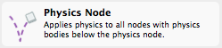
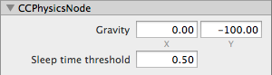
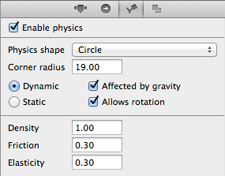
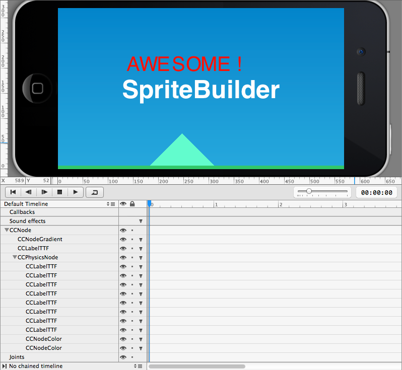
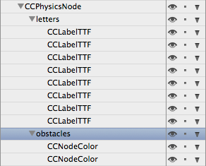
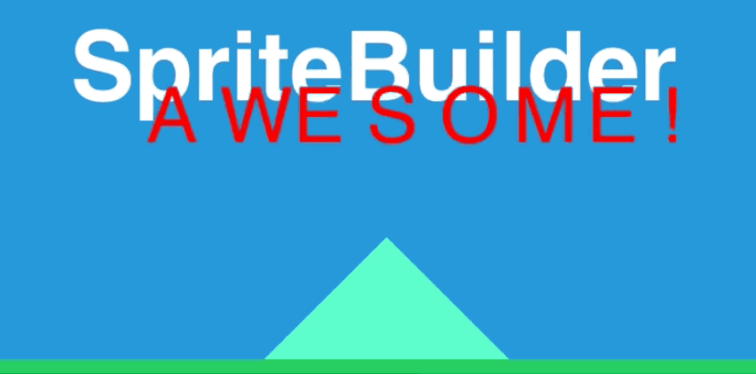
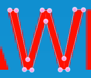
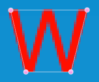

# Working with Physics Bodies

SpriteBuilder makes designing physics games simple and fun. This article explains how to set up a simple physics demo with SpriteBuilder. You should follow the steps so that you can experiment, however this guide also works without following the individual steps.

## The Physics Node

### Setup Steps
<table border="0"><tr><td width="48px" bgcolor="#d0f0ff"><strong>Info</strong></td><td bgcolor="#d0f0ff">
<ol>
<li>Run <strong>File => New => Project</strong> to create a new SpriteBuilder project.</li>
<li>Select the Node Library View tab. Drag & drop a Physics Node onto the stage.</li>
<li>Select the physics node, change its position to {0,0}.</li>
</ol>
</td></tr></table>

### Guide

The Physics Node represents the *physics world*. Every scene that is supposed to have physics needs at least one Physics Node - and for all intents and purposes you need exactly one Physics Node per scene.

The physics node has properties that affect all physics bodies in its "world". Most notably you can change the strength and direction of gravity. The sleep time threshold determines how long a body needs to be at rest before it is considered to sleep. Sleeping bodies consume less processing power.

<table border="0"><tr><td width="48px" bgcolor="#ffd0d0"><strong>Caution</strong></td><td bgcolor="#ffd0d0">
Do not check the <strong>Enable Physics</strong> checkbox on the Item Physics tab of the Physics Node itself. This would result in unpredictable behavior (ie gravity twice as strong) and is not supported nor intended, see [this issue](https://github.com/spritebuilder/SpriteBuilder/issues/417).
</td></tr></table>

## Adding Physics Bodies

### Setup Steps
 
<table border="0"><tr><td width="48px" bgcolor="#d0f0ff"><strong>Info</strong></td><td bgcolor="#d0f0ff">
<ol>
<li>Add several Label TTF nodes to the Physics Node in the Timeline. The labels need to be children of the CCPhysicsNode.</li>
<li>Change each label's text to a single letter, increase its font size to 40, and position the label to form a word.</li>
<li>On the Item Physics tab of each label, check the Enable Physics checkbox and change the Physics shape to Circle.</li>
<li>Add two color nodes. Check Enable Physics on both, and change their body's type to Static. Position the nodes so that one becomes the floor, the other just an obstacle on the floor.</li>
</ol>
</td></tr></table>

### Guide

Only child nodes of a Physics Node will participate in the physics simulation. So if you want a node to behave like a physics object, you need to ensure the following:

- The node has the **Enable Physics** checkbox checked on its Item Physics tab.
- If the node should be moved through physics forces (ie gravity, collisions) its type has to be set to Dynamic on the Item Physics tab.
- The node must be a child (or grandchild) of a CCPhysicsNode.

Below is a node which has its **Enable Physics** checkbox checked. When loading this SpriteBuilder document, the CCBReader will create an instance of [`CCPhysicsBody`](http://www.cocos2d-swift.org/docs/api/Classes/CCPhysicsBody.html) and assigns it to the node's [`physicsBody`](http://www.cocos2d-swift.org/docs/api/Classes/CCNode.html#//api/name/physicsBody) property, then the reader applies the properties below to the body.

<table border="0"><tr><td width="48px" bgcolor="#d0f0ff"><strong>Info</strong></td><td bgcolor="#d0f0ff">
The properties are explained in greater detail in the [*Editing Body Properties* article](./physics/editing-body-properties).
</td></tr></table>

Only **dynamic** bodies react to forces (ie move by themselves). Dynamic bodies can not be moved/rotated via the Timeline and should not be moved through move/rotate actions.

**Static** bodies are immovable, though you can use the Timeline or actions to move/rotate nodes with static bodies.

The following screenshot illustrates the setup. Multiple nodes, each with physics enabled, have been added to the Physics Node:

Notice that this can quickly become difficult to edit. It is therefore recommended to group nodes by type, use or whatever else seems meaningful. Following is the timeline after adding two groups named *letters* and *obstacles*.

Note that the groups themselves do not have their Enable Physics checkbox checked. It is perfectly okay for the Physics Node to have non-physics child nodes.

The result looks similar to the following animation, due to the use of circle shapes the physics collision behavior is not accurate.

## Editing Physics Shapes

There are two basic collision shapes: **Circle** and **Polygon**. As long as a node's Item Physics tab is selected, the stage will draw and allow you to edit the body's shapes.

Circle Shape | Polygon Shape
- | -
 | ")

The polygon shape defaults to a rectangle that matches the node's bounding box, but you can add or remove vertices. In both cases simply clicking and dragging the pink, circular vertex handles allows you to modify the shape's size respectively to move the vertices.

Task | Action | Notes
- | - | -
**Move Vertex** | Click and Drag vertex
**Add Vertex** | Click on line between vertices | Only when editing Polygon shapes
**Remove Vertex** | Right-click a vertex | Only when editing Polygon shapes

With these commands you can easily create more complex collision shapes, highlighted by this example:

## Tip: Keep Collision Shape Vertex Count Low

Defining the collision shapes coarsely is highly recommended. 

In the above example and depending on the type of game, it might suffice to use just 4 vertices to sufficiently shape the collisions of the letter W. This conserves processing power, fewer vertices means the collision detection algorithm runs faster.

A low vertex count may also prevent undesirable collision behavior, such as objects becoming entangled or stopping at even the slightest bump in the collision shape.

An improved and sufficiently detailed collision shape is shown below:

