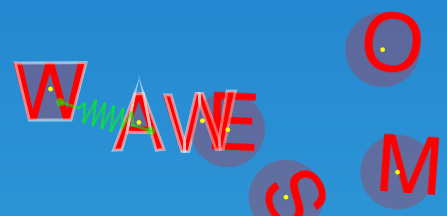

# Programming Physics

This article explains the programmatic interface of the physics engine, how to create physics by code and how to implement collision callback methods.

## Physics Classes

You will find plenty of information about physics in the [Cocos2D Class Reference](http://www.cocos2d-swift.org/docs/api). Following are the classes used by the physics engine:

- [CCPhysicsNode](http://www.cocos2d-swift.org/docs/api/Classes/CCPhysicsNode.html) represents the physics world and provides a physics simulation to its child nodes, provided that the children have a physics body. Children have access to the physics node via the [CCNode physicsNode](http://www.cocos2d-swift.org/docs/api/Classes/CCNode.html#//api/name/physicsNode) property.
- [CCPhysicsBody](http://www.cocos2d-swift.org/docs/api/Classes/CCPhysicsBody.html) represents a physics object and is tied directly into any node via the [CCNode physicsBody](http://www.cocos2d-swift.org/docs/api/Classes/CCNode.html#//api/name/physicsBody) property.
- [CCPhysicsShape](http://www.cocos2d-swift.org/docs/api/Classes/CCPhysicsShape.html) defines a body's collision shape. Its interface is largely duplicated in CCPhysicsBody. You usually only need CCPhysicsShape when creating bodies with multiple shapes, see [CCPhysicsBody bodyWithShapes:](http://www.cocos2d-swift.org/docs/api/Classes/CCPhysicsBody.html#//api/name/bodyWithShapes:).
- [CCPhysicsJoint](http://www.cocos2d-swift.org/docs/api/Classes/CCPhysicsJoint.html) represents a joint. Use it to create one of multiple joint types and to access joint properties, including the attached bodies. 
- [CCPhysicsCollisionDelegate](http://www.cocos2d-swift.org/docs/api/Protocols/CCPhysicsCollisionDelegate.html) is a protocol that needs to be implemented by the class assigned to the [CCPhysicsNode collisionDelegate](http://www.cocos2d-swift.org/docs/api/Classes/CCPhysicsNode.html#//api/name/collisionDelegate) in order for collision callback methods to be called.
- [CCPhysicsCollisionPair](http://www.cocos2d-swift.org/docs/api/Classes/CCPhysicsCollisionPair.html) is an object received by every collision callback method which contains detailed information about the current collision.

## Creating the Physics World

To add physics to a scene you need to add at least one (and typically only one) `CCPhysicsNode` to the scene. For example:

#### Objective-C
    CCPhysicsNode* physicsNode = [CCPhysicsNode node];
    [self addChild:physicsNode];
    
#### Swift
    var physicsNode = CCPhysicsNode.node() as CCPhysicsNode
    self.addChild(physicsNode)

### Enabling Debug Drawing

For debugging purposes you can enable debug drawing which draws the body's shapes semi-transparently and draws joint connections with green lines. This is mainly useful when you create bodies in code and want to verify whether joint connections and shapes have been properly setup.

<table border="0"><tr><td width="48px" bgcolor="#d0ffd0"><strong>Tip</strong></td><td bgcolor="#d0ffd0">
When using SpriteBuilder you can visually see the shapes and joints you create so there's much less room for accidental issues that require debug drawing to locate them.
</td></tr></table>

To enable debug drawing add the following line after initializing the physics node:

#### Objective-C
    physicsNode.debugDraw = YES;

#### Swift
	physicsNode.debugDraw = true

This results in an output similar to this:

    
    
## Creating Physics-Enabled Nodes

For a node to have physics, it needs to have a valid `CCPhysicsBody` instance assigned to its `physicsBody` property. Furthermore it needs to be a child (or "grandchild") of a `CCPhysicsNode`. 

This minimal example assumes that the `physicsNode` variable from above code fragment is in scope:

#### Objective-C
    CCSprite* sprite = [CCSprite spriteWithImageNamed:@"player.png"];
    sprite.physicsBody = [CCPhysicsBody bodyWithCircleOfRadius:10.0 andCenter:CGPointZero];
    [physicsNode addChild:sprite];

#### Swift
    var sprite = CCSprite(imageNamed: "player.png")
    sprite.physicsBody = CCPhysicsBody(circleOfRadius: 10.0, andCenter: CGPointZero)
    physicsNode.addChild(sprite)

In the above example the created physics body is dynamic, which means the body is actually taking over updating the node's position and rotation properties. Still, during initialization of the node it does not matter whether you set the node's position first, then create the physics body, or vice versa.

See the [CCPhysicsBody reference](http://www.cocos2d-swift.org/docs/api/Classes/CCPhysicsBody.html) for a list of possible body types and properties.

### Creating Bodies with Multiple Shapes

A body is not limited to a single shape. Sometimes you may need a body composed of multiple shapes. This is done by first creating the `CCPhyiscsShape` instances, then creating a `CCPhysicsBody` with an array of shapes.

#### Objective-C
    CCPhysicsShape* shape1 = [CCPhysicsShape circleShapeWithRadius:5 center:CGPointZero];
    CCPhysicsShape* shape2 = [CCPhysicsShape rectShape:CGRectMake(0, 0, 50, 200) cornerRadius:10];
    CCPhysicsBody* body = [CCPhysicsBody bodyWithShapes:@[shape1, shape2]];

#### Swift
    let shape1 = CCPhysicsShape(circleShapeWithRadius: 5, center: CGPointZero)
    let shape2 = CCPhysicsShape(rectShape: CGRect(x: 0, y: 0, width: 50, height: 200), cornerRadius: 10)
    let body = CCPhysicsBody(shapes: [shape1, shape2])

See the [CCPhysicsShape reference](http://www.cocos2d-swift.org/docs/api/Classes/CCPhysicsShape.html) for a list of shape types and their properties.

## Connecting Bodies with Joints

Once you have at least two `CCPhysicsBody` instances you can connect them together with a `CCPhysicsJoint`. To create a joint and add it to the physics simulation you merely need to call one of the joint initializers, for example:

#### Objective-C
	[CCPhysicsJoint connectedMotorJointWithBodyA:bodyA bodyB:bodyB rate:5];

#### Swift
    CCPhysicsJoint(motorJointWithBodyA: bodyA, bodyB: bodyB, rate: 5)

You only need a reference to the returned `CCPhysicsJoint` instance if you want to modify joint properties, for example:

#### Objective-C
	CCPhysicsJoint* joint = [CCPhysicsJoint connectedMotorJointWithBodyA:bodyA bodyB:bodyB rate:5];
	joint.maxForce = 500;
	joint.breakingForce = 75;
	joint.collideBodies = NO;

#### Swift
    let joint = CCPhysicsJoint(motorJointWithBodyA: bodyA, bodyB: bodyB, rate: 5)
    joint.maxForce = 500;
    joint.breakingForce = 75;
    joint.collideBodies = false;

See the [CCPhysicsJoint reference](http://www.cocos2d-swift.org/docs/api/Classes/CCPhysicsJoint.html) for details about the joint properties and methods.

### Accessing Joints

Every `CCPhysicsBody` instance has a list of joints it is connected with. You can enumerate a body's joints as follows:

#### Objective-C
	for (CCPhysicsJoint* joint in self.physicsBody.joints) {
		NSLog(@"connected with: %@", joint);
	}
	
#### Swift
    for joint in self.physicsBody.joints {
        NSLog("connected with: %@", joint.description)
    }

### Identifying Joints

If you need to identify a specific joint, you need to provide the information to identify the joint in the two connected bodies. Typically you would use the node's `name` properties but you could also use the [CCNode userObject](http://www.cocos2d-swift.org/docs/api/Classes/CCNode.html#//api/name/userObject) to store additional information for a joint in the connected nodes.

To identify a given joint, enumerate the joints of a body and compare their identification information of the connected nodes:

#### Objective-C
	for (CCPhysicsJoint* joint in self.physicsBody.joints) {
		if ([joint.bodyA.node.name isEqualToString:@"player-torso] &&
		    [joint.bodyB.node.name isEqualToString:@"player-head"]) {
	    	NSLog(@"found the neck joint: %@", joint);
	    }
	}

#### Swift
    for joint in self.physicsBody.joints {
        if (joint.bodyA!.node.name == "player-torso" &&
            joint.bodyB!.node.name == "player-head") {
            NSLog("found the neck joint: %@", joint.description);
        }
    }

Though the above example should rarely be needed and not used frequently (ie every frame) due to the property accessor and string comparison overhead. Normally you would just store the joints as a weak ivar or property in the associated node subclasses where you need to use them. 

<table border="0"><tr><td width="48px" bgcolor="#ffffc0"><strong>Note</strong></td><td bgcolor="#ffffc0">
Ivars and properties referencing joints should be declared `weak` so that if you store the same joint in both node's subclasses both of them become nil when invalidating a joint. In general there's little need to keep a reference to a joint after it has been invalidated.
</td></tr></table>

### Removing a Joint

To remove a joint you need to send the joint the `invalidate` message:

#### Objective-C
	[joint invalidate];

#### Swift
    joint.invalidate()

The above note still applies: joint ivars / properties should be declared as `__weak` or `weak` respectively to allow invalidated joints to deallocate properly.

However you can keep a strong reference to an invalidated joint, but you only need to do so if you need to access the joint's properties after it has been invalidated (removed). For instance if you need to create a new, similar joint with (some of) the same properties of the old joint. 

In such cases it is customary to set the joint ivar or property to nil after the joint has been invalidated or when it is no longer needed:

#### Objective-C
	[_joint invalidate];
	_joint = nil;

#### Swift
    joint.invalidate()
    joint = nil

<table border="0"><tr><td width="48px" bgcolor="#ffffc0"><strong>Note</strong></td><td bgcolor="#ffffc0">
Note that you can not re-use an invalidated joint: you have to create a new one, assigning the old joint's properties if and as needed.
</td></tr></table>

## Receiving Collision Callback Methods

In order to receive collision callback methods a class needs to implement the `CCPhysicsCollisionDelegate` protocol and an instance of that class needs to be assigned to the physics node. 

Furthermore, physics bodies can be set up to filter collisions (not colliding) with specific groups of bodies via categories and masks. The bodies can also be assigned a collision type string to run specific callback methods rather than the generic ones.

See also the [CCPhysicsCollisionDelegate reference](http://www.cocos2d-swift.org/docs/api/Protocols/CCPhysicsCollisionDelegate.html).

### Registering a Collision Delegate

It is common to subclass `CCPhysicsNode` to let it become its own collision callback delegate, though any class implementing the `CCPhysicsCollisionDelegate` protocol will work. The subclass would look as follows:

#### Objective-C
	// MyPhysicsNode.h
	@interface MyPhysicsNode : CCPhysicsNode <CCPhysicsCollisionDelegate>
	@end
	
	...
	
	// MyPhysicsNode.m
	#import "MyPhysicsNode.h"
	@implementation MyPhysicsNode
	
	// implement collision callback methods here, for example:
	-(BOOL) ccPhysicsCollisionBegin:(CCPhysicsCollisionPair*)pair 
	                         player:(CCNode*)player
	                          enemy:(CCNode*)enemy {
		NSLog(@"player collided with enemy");
		return YES;
	}

	@end
	
#### Swift
	// add the CCPhysicsCollisionDelegate protocol to the class:
	class MainScene: CCNode, CCPhysicsCollisionDelegate {
	
	...
	
    func ccPhysicsCollisionBegin(pair: CCPhysicsCollisionPair, player: CCNode, enemy: CCNode) -> Bool {
        NSLog("player collided with enemy")
        return true
    }

<table border="0"><tr><td width="48px" bgcolor="#d0ffd0"><strong>Tip</strong></td><td bgcolor="#d0ffd0">
Note that if you return NO/false from the ccPhysicsCollisionBegin method, the collision will be ignored. This should only be used if collisions need to be ignored based on the runtime state. For collisions that should always/never be ignored, prefer to use the collision categories and masks for better performance. A description of categories and masks follows further down.
</td></tr></table>
	
In order for the collision callback methods to actually be called, an instance of the class that implements the `CCPhysicsCollisionDelegate` protocol must be assigned to the `collisionDelegate` property. An updated physics node initialization would look as follows:

#### Objective-C
    MyPhysicsNode* physicsNode = [MyPhysicsNode node];
    physicsNode.collisionDelegate = self;
    [self addChild:physicsNode];

#### Swift
    let physicsNode = CCPhysicsNode()
    physicsNode.collisionDelegate = self
    self.addChild(physicsNode)
        
In this case `MyPhysicsNode` is assumed to be a subclass of `CCPhysicsNode`.

### Assigning Collision Types

You can assign any node a collision type so that it runs the corresponding collision callback method (see below).

#### Objective-C
    _player.physicsBody.collisionType = @"player";
    _enemy.physicsBody.collisionType = @"enemy";

#### Swift
    player.physicsBody.collisionType = "player"
    enemy.physicsBody.collisionType = "enemy"

### How Collision Types change Collision Callback Signatures

The Collision Type determines the method signatures of the class implementing the [`CCPhysicsCollisionDelegate` protocol](http://www.cocos2d-swift.org/docs/api/Protocols/CCPhysicsCollisionDelegate.html).

The signature of collision delegate methods follows this format:

	// Objective-C
	ccPhysicsCollisionXXX:typeA:typeB:
	
	// Swift
	ccPhysicsCollisionXXX(pair, typeA, typeB)

Where `XXX` stands for the type of event (`Begin`, `PreSolve`, `PostSolve`, `Separate`). With the collision type property you can change the typeA and typeB parameters to create **a callback method that fires only when two bodies of matching collision types collide**.

For example, if you have a body with collision type string `player` and another body with collision type string `enemy` colliding, they will run the following selector, provided that the receiver implements them and is registered as the CCPhysicsNode's [`collisionDelegate`](http://www.cocos2d-swift.org/docs/api/Classes/CCPhysicsNode.html#//api/name/collisionDelegate):

#### Objective-C
	-(BOOL) ccPhysicsCollisionBegin:(CCPhysicsCollisionPair*)pair player:(CCNode*)player enemy:(CCNode*)enemy {
		NSLog(@"player collided with enemy");
		return YES;
	}

	// exactly the same but with typeA/typeB parameter order reversed:
	-(BOOL) ccPhysicsCollisionBegin:(CCPhysicsCollisionPair*)pair enemy:(CCNode*)enemy player:(CCNode*)player {
		NSLog(@"player collided with enemy");
		return YES;
	}

#### Swift
    func ccPhysicsCollisionBegin(pair: CCPhysicsCollisionPair, player: CCNode, enemy: CCNode) -> Bool {
        NSLog("player collided with enemy")
        return true
    }

	// exactly the same but with typeA/typeB parameter order reversed:
    func ccPhysicsCollisionBegin(pair: CCPhysicsCollisionPair, enemy: CCNode, player: CCNode) -> Bool {
        NSLog("player collided with enemy")
        return true
    }
    

If you don't need to be that specific you can test whether a body with a given collision type collided with any other body regardless of collision type. You do so by using `wildcard` as the name for the last parameter:

#### Objective-C
	-(BOOL) ccPhysicsCollisionBegin:(CCPhysicsCollisionPair*)pair player:(CCNode*)player wildcard:(CCNode*)wildcard {
		NSLog(@"the player collided with something");
		return YES;
	}

	-(BOOL) ccPhysicsCollisionBegin:(CCPhysicsCollisionPair*)pair enemy:(CCNode*)enemy wildcard:(CCNode*)wildcard {
		NSLog(@"an enemy collided with something");
		return YES;
	}

#### Swift
    func ccPhysicsCollisionBegin(pair: CCPhysicsCollisionPair, player: CCNode, wildcard: CCNode) -> Bool {
        NSLog("the player collided with something")
        return true
    }

    func ccPhysicsCollisionBegin(pair: CCPhysicsCollisionPair, enemy: CCNode, wildcard: CCNode) -> Bool {
        NSLog("an enemy collided with something")
        return true
    }

So instead of implementing a single collision callback method and then determining the types of bodies before further processing them, thanks to collision types you can just implement specialized collision callback methods that fire only when specific bodies collide.

### Generic Collision Callbacks

Above specialized collision callback methods run in addition to the default `ccPhysicsCollisionXXX:typeA:typeB:` method signature which, if implemented, would be called for *all* collisions. It's your responsible to correctly identify nodes. It's also a rather brute-force approach to collision handling, and is increasingly discouraged the more diverse collision events are in the app, and the more frequently they end up being dismissed (ie collision ignored or allowed, but not running any collision event code either).

Therefore should prefer to use collision types and specialized collision callback handlers rather than using a generic collision callback method like this one below:

#### Objective-C
	-(BOOL) ccPhysicsCollisionBegin:(CCPhysicsCollisionPair*)pair typeA:(CCNode*)nodeA typeB:(CCNode*)nodeB {
		NSLog(@"a node %@ collided with another node %@", nodeA, nodeB);
		return YES;
	}

#### Swift
    func ccPhysicsCollisionBegin(pair: CCPhysicsCollisionPair, typeA: CCNode, typeB: CCNode) -> Bool {
        NSLog("a node %@ collided with another node %@", typeA, typeB);
        return true
    }

<table border="0"><tr><td width="48px" bgcolor="#ffd0d0"><strong>Caution</strong></td><td bgcolor="#ffd0d0">
In the generic method signature it is undefined which of the two colliding nodes is passed in as `nodeA` and which is passed in as `nodeB`, and their order can change any time. Since it is cumbersome, error-prone and often inefficient to identify which node is which, you should avoid using the generic collision callback methods altogether.</td></tr></table>

### Filtering Collisions with Categories and Masks

For a more thorough explanation on how collision Categories and Masks work, see the [Editing Body Properties article](./physics/editing-body-properties). 

It should suffice to say that by default all bodies collide with each other. Setting Categories and Masks is required only when you want certain bodies to **not collide** with certain other bodies. You do so by specifying which categories of bodies can collide with what other categories of bodies. So you go from "collides with everything" to "collides only if both bodies specify that they should collide with one another" once you start assigning either a category or mask. You have to make a matching connection in both bodies for them to collide, as illustrated by this table:

&nbsp; | Player | Enemy
- | - | -
**Categories** | `player` | `enemy`
**Masks** | `enemy` | `player`

### Assigning Categories and Masks

The `collisionCategories` and `collisionMask` properties are arrays containing NSString objects. Let's put the player in a category and tell its mask to collide with enemy and a few other types:

#### Objective-C
	_player.physicsBody.collisionCategories = @[@"player"];
	_player.physicsBody.collisionMask = @[@"enemy", @"obstacles", @"items"];
	
#### Swift
    player.physicsBody.collisionCategories = ["player"]
    player.physicsBody.collisionMask = ["enemy", "obstacles", "items"]

Now you have to assign the enemy's body to the enemy category and include player in its mask for the collision to work:

#### Objective-C
	_enemy.physicsBody.collisionCategories = @[@"enemy"];
	_enemy.physicsBody.collisionMask = @[@"player", @"obstacles", @"projectiles"];

#### Swift
	enemy.physicsBody.collisionCategories = ["enemy"]
	enemy.physicsBody.collisionMask = ["player", "obstacles", "projectiles"]

Note how the player's masks include the `enemy` category, while the enemy's masks include the `player` category. Only if both bodies have one of the other body's categories string in their mask list will they collide.

### Adding and Removing Categories / Masks

The categories and mask arrays are immutable NSArray instances. If you need to modify the categories or masks at runtime, you must specify all the categories or masks that you want to keep. If you don't know the exact contents of the mask you can use a temporary `NSMutableArray` instance to modify the contents of the categories or mask arrays. In Swift this code fragment is particularly trivial and intuitive.

Here's how you can add a mask string to the player's mask:

#### Objective-C
	NSMutableArray* mask = [NSMutableArray arrayWithArray:_player.physicsBody.collisionMask];
	[mask addObject:@"ladders"];
	_player.physicsBody.collisionMask = mask;

#### Swift
    player.physicsBody.collisionMask.append("ladders")

Here's an example removing the projectiles string from the enemy's mask, so it won't collide with projectiles anymore:

#### Objective-C
	NSMutableArray* mask = [NSMutableArray arrayWithArray:_enemy.physicsBody.collisionMask];
	[mask removeObject:@"projectiles"];
	_enemy.physicsBody.collisionMask = mask;

#### Swift
    let**** mask = NSMutableArray(array: self.physicsBody.collisionMask)
    mask.removeObject("projectiles")
    self.physicsBody.collisionMask = mask

### Using Collision Groups

In addition you can assign bodies to a `collisionGroup`. If two bodies are in the same group, they will not collide regardless of their categories/masks. As collisionGroup you can use any object, typically you would use a string constant. In a multiplayer game you might want to make the players not collide with each other as follows:

#### Objective-C
	_player1.physicsBody.collisionGroup = @"players";
	_player2.physicsBody.collisionGroup = @"players";

#### Swift
	player1.physicsBody.collisionGroup = "players"
	player2.physicsBody.collisionGroup = "players"
