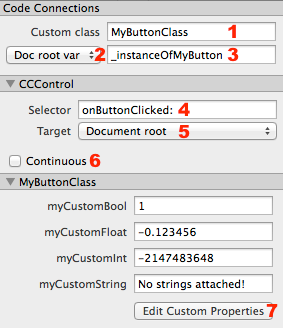
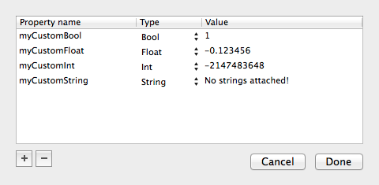
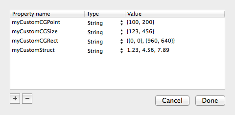

# Code Connections

The Item Code Connections tab enables you to assign a custom class to a node, to assign the node reference to an existing ivar or property in the document root class, to specify selector and target for nodes inheriting from CCControl and to create and edit custom properties.

1. **Custom Class** is the name of an Objective-C class that you've added or intend to add to the Xcode project. <table border="0"><tr><td width="48px" bgcolor="#ffd0d0"><strong>Caution</strong></td><td bgcolor="#ffd0d0">
The custom class must exist in the project and it *must inherit from the node's super class*! A runtime error will occur if it does not. For instance the custom class used by a Sprite node must inherit from CCSprite, the custom class for a Color Node must inherit from CCNodeColor.
</td></tr></table><table border="0"><tr><td width="48px" bgcolor="#d0ffd0"><strong>Tip</strong></td><td bgcolor="#d0ffd0">
You can use the name of the node's class itself, for instance `CCPhysicsNode` if the node is a Physics Node. This would allow you to add Custom Properties which already exist in the class but are not (yet) editable in SpriteBuilder. In this instance you could add the custom properties `debugDraw` (type: `bool`) and `iterations` (type: `int`) to be able to enable/disable debug drawing and to tweak the number of solver iterations from within SpriteBuilder.
</td></tr></table>
1. **Var Assignment Target** defines to which node the variable in the text field on the right should be assigned to. If set to *Doc root var* the current document's root node must have a custom class with a @property or instance variable of the given name. Otherwise a runtime error will occur. <table border="0"><tr><td width="48px" bgcolor="#ffffc0"><strong>Note</strong></td><td bgcolor="#ffffc0">
Unless you explicitly specify an *Owner* reference when calling one of CCBReader's 'load:owner:' methods you have to leave this setting to its default value *Doc root var* for it to have any function. It is not currently possible to [assign the variable to the document's parent document](https://github.com/spritebuilder/SpriteBuilder/issues/418).
</td></tr></table>
1. **Variable Name** is the exact name of either an instance variable (ivar) or @property in the targeted class. The ivar or property must be of type `id` or `CCNode*` or a pointer to the node's super or custom class, in this instance both `CCButton*` and `MyButtonClass*` would be legal. <table border="0"><tr><td width="48px" bgcolor="#d0ffd0"><strong>Tip</strong></td><td bgcolor="#d0ffd0">
If you have an auto-synthesized @property and you want to assign the variable directly to the ivar rather than going through the property just prefix the variable with a leading underscore, [as is customary for auto-synthesized instance variables](https://developer.apple.com/library/ios/documentation/Cocoa/Conceptual/ProgrammingWithObjectiveC/EncapsulatingData/EncapsulatingData.html#//apple_ref/doc/uid/TP40011210-CH5-SW6).
</td></tr></table>
4. **Selector** is the name of a selector (method) which will be called when the control is clicked (Button) or changed its value (Slider). The selector must be implemented in the targeted class (here: *Document root* which refers to the custom class *MyButtonClass*). The selector can take no parameters or optionally can be written with a colon at the end. In that case the selector needs to accept a single parameter of type `(CCControl*)sender`. In this case `(CCButton*)sender` would also be legal and more specific, since the node being edited is a Button node.
5. **Selector Target** allows you to change the targeted node for the selector. The default *Document root* assumes the selector is implemented in the custom class of the document's root node. The alternative *Owner* is only valid if you pass an owner object to one of CCBReader's `load:owner:` methods. <table border="0"><tr><td width="48px" bgcolor="#ffffc0"><strong>Note</strong></td><td bgcolor="#ffffc0">
A common mistake is to incorrectly assume that the selector has to be implemented in the custom class of the Button/Slider node (here: *MyButtonClass*).
</td></tr></table>
6. **Continuous** will run the selector continuously. For buttons the selector will be called as long as the button is pressed down. Without Continuous the selector will run only once, when the finger is lifted while it rested on the button. For sliders the Continuous flag will cause the selector to run every time the slider value changes, otherwise the selector will run once after the slider has been adjusted.
7. **Edit Custom Properties** is explained below.

## Edit Custom Properties

The **Edit Custom Properties** button appears on the Item Code Connections and Item Properties tabs once the *Custom Class* field contains a string. 

<table border="0"><tr><td width="48px" bgcolor="#ffd0d0"><strong>Caution</strong></td><td bgcolor="#ffd0d0">
SpriteBuilder does not verify whether the Custom Class actually exists in the project, nor does it verify whether the given properties exist as either @property or instance variable (ivar) in said class. A mistake in either will lead to a runtime error or will be logged as a warning when loading the document.
</td></tr></table>

Clicking the **Edit Custom Properties** button brings up the Custom Properties Editor.

The **[+]** and **{-]** buttons allow you to add or remove a custom property. You can change the name of the property by double-clicking its name in the *Property name* column. The property value can also be edited by double-clicking an entry in the *Value* column.

The property *Type* can be set to *Bool*, *Float*, *Int* or *String*. There is a way to also support CGPoint and other types, see the *Custom Property Conversion* heading below.

After clicking *Done* the custom properties list in both the Item Code Connections and Item Properties tabs will be updated. See the screenshot at the top for an example (7). You can then edit the property values on the Inspector. You only need to use the Custom Properties Editor if you want to add, remove or rename properties.

### Custom Property Conversion

You may have noticed the absence of `CGPoint`, `CGSize` and `CGRect` properties and some other built-in types (ie `double`). You may want to be able to edit these and other property types in SpriteBuilder. This is all possible by encoding the values as strings and implementing a specific method in the node's custom class.

In this example, the following custom properties were added to the *MainScene.ccb* document:

The Core Graphics (CG) types use the string format with curly braces supported by built-in CG conversion methods, for instance: `CGPoint p = CGPointFromString(@"{100, 200}")`. For other types it is up to you to correctly decode the values from the supplied string.

The custom class of MainScene.ccb is named `MainScene` and its header includes the following custom struct and properties:

	// Objective-C
	#import "CCNode.h"

	typedef struct {
		double doubleValue1;
		double doubleValue2;
		double doubleValue3;
	} MyStruct;

	@interface MainScene : CCNode

	@property CGPoint myCustomCGPoint;
	@property CGSize myCustomCGSize;
	@property CGRect myCustomCGRect;
	@property MyStruct myCustomStruct;

	@end

	// Swift
	import Foundation

	class MainScene: CCNode
	{
		struct MyStruct {
    		var doubleValue1 : Double = 0.0
		    var doubleValue2 : Double = 0.0
    		var doubleValue3 : Double = 0.0
		}
		
    	var _myCustomCGPoint = CGPointZero
	    var _myCustomCGSize = CGSizeZero
    	var _myCustomCGRect = CGRectZero
	    var _myCustomStruct = MyStruct()
	    ..

In the MainScene.m implementation you then need to implement the `setValue:forKey:` method because all property assignments run through that Key-Value-Coding (KVC) method. [Learn more about KVC](https://developer.apple.com/library/mac/documentation/Cocoa/Conceptual/KeyValueCoding/Articles/BasicPrinciples.html#//apple_ref/doc/uid/20002170-178791).

Every time this method gets called, you check whether the `key` string equals one of the custom property names. If it does, you apply the proper conversion from NSString to the desired data type. The following example purposefully omits any sanity checks for brevity. In your own you should certainly add assertions that test whether the given value has the proper type and format.

	// Objective-C
	#import "MainScene.h"

	@implementation MainScene

	-(void) setValue:(id)value forKey:(NSString *)key {
		if ([key isEqualToString:@"myCustomCGPoint"]) {
			_myCustomCGPoint = CGPointFromString(value);
		} 
		else if ([key isEqualToString:@"myCustomCGSize"]) {
			_myCustomCGSize = CGSizeFromString(value);
		}
		else if ([key isEqualToString:@"myCustomCGRect"]) {
			_myCustomCGRect = CGRectFromString(value);
		}
		else if ([key isEqualToString:@"myCustomStruct"]) {
			NSArray* components = [value componentsSeparatedByString:@","];
			_myCustomStruct.doubleValue1 = [components[0] doubleValue];
			_myCustomStruct.doubleValue2 = [components[1] doubleValue];
			_myCustomStruct.doubleValue3 = [components[2] doubleValue];
		}
		else {
			// let the super implementation handle this property assignment
			[super setValue:value forKey:key];
		}
	}

	-(void) didLoadFromCCB {
		NSLog(@"%@", NSStringFromCGPoint(_myCustomCGPoint));
		NSLog(@"%@", NSStringFromCGSize(_myCustomCGSize));
		NSLog(@"%@", NSStringFromCGRect(_myCustomCGRect));
		NSLog(@"%f, %f, %f", _myCustomStruct.doubleValue1, _myCustomStruct.doubleValue2, _myCustomStruct.doubleValue3);
	}

	@end

	// Swift
    override func setValue(value: AnyObject?, forKey key: String) {
        if key == "myCustomCGPoint" {
            _myCustomCGPoint = CGPointFromString(value as String)
        }
        else if key == "myCustomCGSize" {
            _myCustomCGSize = CGSizeFromString(value as String)
        }
        else if key == "myCustomCGRect" {
            _myCustomCGRect = CGRectFromString(value as String)
        }
        else if key == "myCustomStruct" {
            var components = (value as String).componentsSeparatedByString(",")
            _myCustomStruct.doubleValue1 = (components[0] as NSString).doubleValue
            _myCustomStruct.doubleValue2 = (components[1] as NSString).doubleValue
            _myCustomStruct.doubleValue3 = (components[2] as NSString).doubleValue
        }
        else {
            // let the super implementation handle this property assignment
            super.setValue(value, forKey: key)
        }
    }
    
    func didLoadFromCCB() -> Void {
        NSLog("%@", NSStringFromCGPoint(_myCustomCGPoint))
        NSLog("%@", NSStringFromCGSize(_myCustomCGSize))
        NSLog("%@", NSStringFromCGRect(_myCustomCGRect))
        NSLog("%f, %f, %f", _myCustomStruct.doubleValue1, _myCustomStruct.doubleValue2, _myCustomStruct.doubleValue3)
    }

<table border="0"><tr><td width="48px" bgcolor="#ffd0d0"><strong>Caution</strong></td><td bgcolor="#ffd0d0">
Do not forget to call <code>[super setValue:value forKey:key]</code> for any key that you don't handle yourself! Otherwise none of the node's properties would get assigned, including the built-in properties like position, rotation, scale, sprite frame, etc. On the other hand be sure not to call the super implementation if you <strong>do</strong> handle a given key, doing so would result in an infinite recursion (app freezes).
</td></tr></table>

When running the project with this MainScene class, the Debug Console in Xcode will log something similar to these lines, confirming that KVC is truly awesome:

	{100, 200}
	{123, 456}
	{{0, 0}, {960, 640}}
	1.230000, 4.560000, 7.890000

Not surprisingly the output of `NSStringFromCGPoint` for instance is the same string that you fed into `CGPointFromNSString`.

<table border="0"><tr><td width="48px" bgcolor="#d0ffd0"><strong>Tip</strong></td><td bgcolor="#d0ffd0">
If you need to frequently convert a string to one of the CG types it makes sense to create an NSString category. An NSString instance gets the <code>pointValue</code>, <code>sizeValue</code> and <code>rectValue</code> methods sent automatically when CCBReader loads a document. If you implement these methods in a NSString category you can make the conversion from NSString to CG types work automatically without having to implement a <code>setValue:forKey:</code> method in several node's custom classes.
 You may even be able to support other types where the NSString instance receives the more generic method <code>-(NSValue*)getValue:(void*)buffer</code>. You can ignore the buffer because <code>self</code> represents the string that contains the to be converted string, and all you need to do is to return the appropriate NSValue representation of your data type.
</td></tr></table>

You can of course do more than just converting the values in the `setValue:forKey:`method. For instance you could assign certain properties to one of the custom class' child nodes. You may want to use a string like `leftLeg.maxAngle` that allows you to look up the node named *leftLeg* and then assign the *maxAngle* value to a NSMutableDictionary that you've previously assigned to each child node's *userObject* property. That way you don't have to create a custom class for every child node in composite nodes - for example a player consisting of separate nodes for its limbs and weapon/armor attachments.
