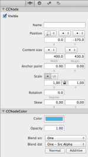
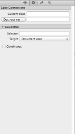
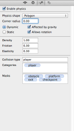
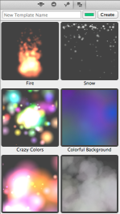

# Inspector Tabs

The Inspector provides access to the selected node's properties (Node Properties), to assign classes, variables and selectors to the node (Node Code Connections), and to edit a node's physics properties (Node Physics). For particle system nodes you can also select from one of the built-in particle templates (Node Templates).

**Node Properties** | &nbsp; | **Node Code Connections** | &nbsp; | **Node Physics** | &nbsp; | **Node Templates**
:- | :- | :- | :- | :- | :- | :-
 | &nbsp; |  | &nbsp; |  | &nbsp; | 
**Top**: Common node properties (*CCNode*).  **Bottom**: Node-specific properties (*CCNodeColor*). | &nbsp; | **Top**: Custom Class and Variable Assignment.  **Bottom**: *CCControl* Selector and Target. | &nbsp; | **Top & Center**: Physics properties. **Bottom**: Type, Categories and Masks. | &nbsp; | Particle System Templates.
 
The Inspector Tabs are available when a node is selected. 

<table border="0"><tr><td width="48px" bgcolor="#ffffc0"><strong>Note</strong></td><td bgcolor="#ffffc0">
Multi-selection property editing is currently not supported, see [this issue](https://github.com/spritebuilder/SpriteBuilder/issues/147).
</td></tr></table>

The **Properties** shown depend on what kind of node is selected. Some properties are readonly if the selected node is the Root Node. On the Node Properties tab, the common properties of CCNode are always available, with node-specific properties following below, each in its own section labelled with the name of the node class (ie CCNodeColor for Color Node properties).

On the **Code Connections** tab the Selector and Target properties are only available if a node is selected that is a subclass of CCControl (currently: Button, Slider).

The **Physics** tab is disabled for Sub File nodes and should not be used with the Physics Node. Enabling physics and setting the body type to dynamic will prevent you from adding Keyframes to that node's Timeline.

<table border="0"><tr><td width="48px" bgcolor="#ffffc0"><strong>Note</strong></td><td bgcolor="#ffffc0">
It is currently possible to enable physics for Sub File and Physics nodes due to a bug, see [this issue](https://github.com/spritebuilder/SpriteBuilder/issues/427).
</td></tr></table>

Node **Templates** are currently only available when a Particle System node is selected. The Templates tab allows you to apply a Template by double-clicking the template's preview image. You can also add the current Particle System and its properties as a template with a specified background color via the *Create* button at the top.
