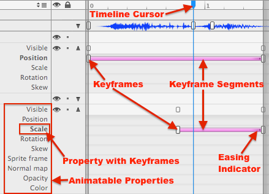
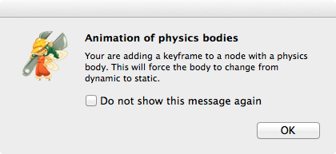
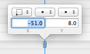
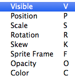
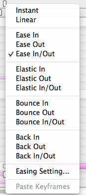
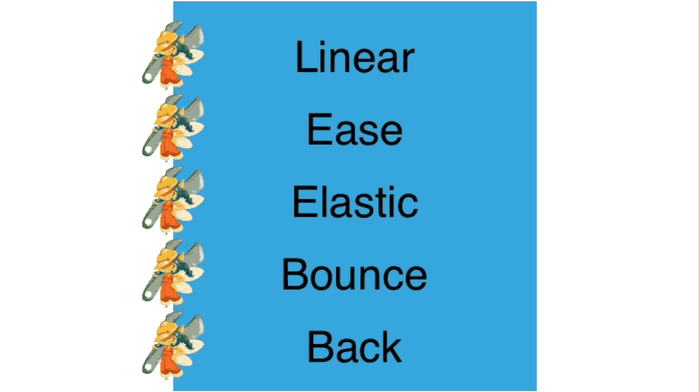

# Keyframe Editor

The Keyframe Editor encompasses the right side of the Timeline view. This is where you edit Keyframes and Interpolation Mode. The Keyframe Editor is also tied into the Node Tree as each node can have several properties animated.

If the expand/collapse triangle of a node is pointing up, that node shows a list of properties that can be animated with Keyframes. Properties that have at least one Keyframe are printed in bold.

The Keyframes are empty rectangles, slightly higher than wide. A smaller keyframe is drawn for each node above any time stamp that has a Keyframe on it. This smaller keyframe, located within the Visible bar, just indicates whether the node has any keyframes at all if the node is collapsed (triangle arrow pointing down).

Between any two Keyframes of the same property a pink bar is drawn: the Keyframe Segment. Right-clicking a Keyframe Segment allows you to set the segment's Interpolation Mode. The Interpolation Mode is indicated by a small gradient at the end of either or both sides of the Keyframe Segment.

## Non-Animatable Nodes / Properties

Depending on which node is selected and the type of the node not all properties can be animated. The following conditions affect which nodes and properties can be animated:

- **Root Node**: Only in documents of type *Sprite* can the root node have keyframes. In that case only Sprite Frame, Normal Map, Opacity and Color can be animated. <table border="0"><tr><td width="48px" bgcolor="#d0ffd0"><strong>Tip</strong></td><td bgcolor="#d0ffd0">*Alternative*: use a document of type *Node* or *Layer* and add a single Sprite to it.</td></tr></table>
- **Sub File Node**: Only Visible, Position, Scale, Rotation and Skew can be animated on a Sub File node.
- **Physics Enabled**: Physics enabled nodes currently can only have keyframes if their physics body is set to *Static*. Trying to add keyframes to a physics-enabled node may show a message stating that the body type was changed to *Static*.

- **Skew Property**: Animating the Skew property is generally disallowed for physics-enabled nodes as there is no corresponding skew operation for physics shapes, specifically not for skewing a circle or complex polygon.
- **Sprite Frame Property**: Obviously this property can only be animated for Sprite and Sprite9Slice nodes.
- **Color and Opacity Properties**: Only animatable for nodes with those properties, ie Sprite, Sprite9Slice, LabelTTF, LabelBMFont, Color and Gradient nodes.

## Working with Keyframes

To add a Keyframe, first ensure you are editing the desired Timeline. Use the *Timeline Menu* to switch the Timeline if necessary.

1. Select a node or ensure the correct node is currently selected. <table border="0"><tr><td width="48px" bgcolor="#ffd0d0"><strong>Caution</strong></td><td bgcolor="#ffd0d0">
You can not add Keyframes if you have multiple nodes selected.
</td></tr></table>
1. Drag the Timeline Cursor to the time stamp where you would like to add the Keyframe.
1. Use the `Animation => Insert Keyframe` menu to add a Keyframe at the current time stamp, or use the corresponding keyboard shortcut (recommended).
2. Double-click the Keyframe to edit its properties. Alternatively you can edit the corresponding property on the Properties Inspector view.

**Double-Clicking a Keyframe** brings up a small popup menu with the Keyframe's property values and settings. Here a Position Keyframe is being edited:

To delete a Keyframe, select it with the mouse and press the `Backspace` key. Alternatively you can right-click a Keyframe for a context menu with Cut, Copy and Delete items.

### Insert Keyframe Keyboard Shortcuts

### Callback & Sound Effect Keyframes

Callback and Sound Effect Keyframes can be added by holding down the `Option` key when clickin on the Callbacks or Sound effects area in the Keyframe Editor.

Each Callback Keyframe requires you to double-click it and enter a name in the selector field. The selector takes no parameters and must exist in the custom class assigned to the document's root node.

Each Sound Effect Keyframe also requires double-clicking it to assign one of the audio files imported to SpriteBuilder.

Loading or trying to play a Timeline animation in the app with a Callbacks Keyframe without a selector or a Sound Effects Keyframe without an assigned sound effect will cause a runtime error.

## Interpolation Mode

Once you have two Keyframes of the same property, a Keyframe Segment (pink bar) is drawn between the two keyframes. Right-clicking the Keyframe Segment brings up the Interpolation Mode context menu:

Interpolation affects how the animated property is changed over time between two Keyframes. *In* hereby refers to the beginning of the segment whereas *Out* refers to the end of the segment. Logically *In/Out* applies the easing to both the beginning and the end of the segment equally.

The default Interpolation Mode is linear. Instant will disable interpolation, instead the property is changed instantly once the time stamp reaches the given Keyframe.

The *Easing Setting* is only available once either *Ease* or *Elastic* Interpolation Mode is selected. The *Easing Settings* allows you to change the *Rate* (Ease) and *Period* (Elastic) properties.

### Interpolation by Example

