# Node Properties

Node Properties allow you to edit the position, size, scale, rotation and other properties of a node. This article describes the common (CCNode) properties. The Properties of most other nodes are explained in the Graphics, GUI and Physics sections of this documentation.

## Common Node Properties (CCNode)

All nodes inherit from the CCNode class, and therefore the CCNode properties are common to all nodes. They are always drawn at the top of the Properties tab.

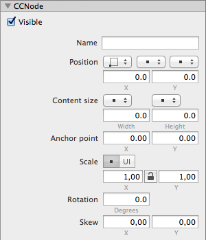

Following is a list of node properties with the equivalent and related code properties in brackets. The dropdown menus and toggle buttons are related to how the property values are interpreted and are explained after the following properties list.

<table border="0"><tr><td width="48px" bgcolor="#d0f0ff"><strong>Info</strong></td><td bgcolor="#d0f0ff">
The code names use <code>node</code> as a placeholder name for a reference to an instance of a CCNode class or subclass. Some properties have multiple code equivalents in order to obtain the raw and point values as well as an enumeration that determines how to interpret the raw value.
</td></tr></table>

Property | Description
- | -
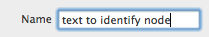 | **Name** (`node.name`) can be used to identify or obtain a reference to the node in code. Changing the name will also change the node's name in the Timeline's Node Tree, provided the Node Tree name of the node hasn't been modified. 
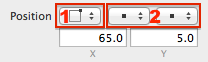 | **Position** (`node.position`, `node.positionInPoints`) determines where the node is drawn. Position is relative to the node's parent node; changing the position of a node (ie moving it) will also move its child nodes.
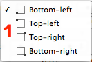 | &nbsp;&nbsp;&nbsp;&nbsp;**Position Origin** changes the coordinate system origin of the node. The default origin is *Bottom-Left* as is customary in Cocos2D/OpenGL. Choose *Top-Left* if you want to use the same origin as Cocoa views. The origin can be changed at any time, changing it will convert the position values but will not alter the location of the node on the Stage. **Note:** The Position Origin is an editor-only setting. In code the coordinate system origin is always *Bottom-Left*.
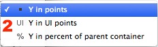 | &nbsp;&nbsp;&nbsp;&nbsp;**Position Type** (`node.positionType`) changes how the position's X/Y coordinates are interpreted. The default is points. See the *Value Types* heading below.
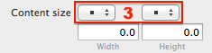 | **Content Size** (`node.contentSize`, `node.contentSizeInPoints`) is the width and height of the node at its original (unscaled) size. Many nodes do not allow to edit this property because it is inherently set by the node (ie a sprite's Content Size is determined by the sprite's image) or simply not supported or not meaningful (ie Sub File, Particle System, Box Layout and others).
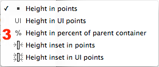 | &nbsp;&nbsp;&nbsp;&nbsp;**Content Size Type** (`node.contentSizeType`) affects how the Content Size values are interpreted. See the *Value Types* heading below.
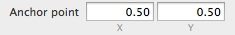  | **Anchor Point** (`node.anchorPoint`, `node.anchorPointInPoints`) determines where the node's content is drawn in relation to the node's position. The anchor point also determines the center point for scale and rotation. The default Anchor Point is `0.0/0.0` for most nodes but is `0.5/0.5` for Sprites, Labels and Button nodes. The Anchor Point is most commonly used to change the alignment of a node (left, right, top, bottom, center and the four corners).
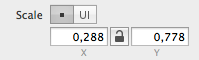 | **Scale** affects how large or small the node is drawn. The default is the node's original scale: `1.0/1.0`. The *Anchor Point* determines the scale center point. The scale buttons change between *in Points* and *in UI Points* scaling modes. The *Aspect Ratio Lock Button* ensures that scaling affects both X and Y equally. **Caution**: For most nodes scaling leads to visual artifacts: aliasing if scale is below 1.0, blurring/pixelation if scale is above 1.0. **Note**: When you change the size of a node on the stage you actually change its Scale, not its Content Size. **Tip**: A negative scale (for instance: `-1.0`) flips the node's content along the given axis.
 | **Rotation** rotates the node around its Anchor Point. Positive values rotate clockwise. Though all values are legal SpriteBuilder tries to keep the rotation value in the range -180 to 180.
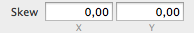 | **Skew** changes the normally rectangular content of a node to that of a [parallelogram](http://en.wikipedia.org/wiki/Parallelogram). The Skew values are in degrees, determining the inner angles in the parallelogram. Thus the valid value range is from -90 to 90.  For example, changing the Skew X coordinate to 20 will move the top two vertices to the right while the two bottom vertices are shifted to the left by an equal amount. **Caution**: The skew angles -90 and 90 produce a node that is skewed to infinity, effectively rendering the node invisible.

## Value Types

Some properties like Position, Content Size and Scale allow you to change how the values are to be interpreted. For the most part this refers to scaling in Points vs UI Points and relative values in percent of the parent's values.

- **.. in Points** will multiply the value by 2 if the device is a tablet device. Otherwise uses the original value.
- **.. in UI Points** will use the value "as is" without applying any scale regardless of device.
- **.. in Percent of Parent Container** makes the value dependent on the Content Size of the parent node.

Effectively the **Points** setting will have a stage designed for a phone resolution scale up by a factor of 2 on tablet devices, as if the tablet devices were approximately the same as phones but with a higher pixel density. The points layout mode provides a very easy way to design layouts that work well on most devices if you consider the so-called ["safe areas"](http://en.wikipedia.org/wiki/Safe_area_(television)).

The **UI Points** scaling mode will use the values as they are regardless of whether the app runs on a phone or tablet. Effectively this approximately doubles the available screen space on tablet devices, allowing you to show more of the world/menu at once. Whether allowing a larger area of the world to be seen at once by tablet users is a game design decision that should not be taken lightly.

Scaling values to **Percent of Parent Container** causes the value to adapt to whatever Content Size the parent node uses.

<table border="0"><tr><td width="48px" bgcolor="#ffffc0"><strong>Note</strong></td><td bgcolor="#ffffc0">
Percent scaling does not preserve aspect ratio of the node's position or content size if the parent value's aspect ratio changes. For instance, assume the positions of several nodes are set to use the percent type, and they are all children of the scene, and the nodes are perfectly aligned on a 4" iPhone (aspect ratio: 1.77) in landscape mode. Running the same app on a 3.5" iPhone (aspect ratio: 1.50) would cause the nodes to overlap horizontally due to the smaller screen width and thus smaller content size of the parent scene.
</td></tr></table>

### Inset Value Types

The Content Size property allows to specify *inset* value types. The meaning of *in Points* vs *in UI Points* is the same as for other Value Types (see above).

**Definition**: An inset refers to something that is inside something else, in context of SpriteBuilder an inset can be considered a margin between the edited node and its parent node.

**Example**: If a node A is contained inside a parent node B, and then you set the Content Size Type to inset in points and enter 10 for both width and height, the Content Size of node A will be 10 points smaller on all sides than node B's Content Size. If node B's Content Size is `80/80` points, the absolute Content Size width and height of node A would both be `80 - 10 - 10 = 60` resulting in an absolute Content Size of `60/60`.

## Sub File Node Properties (CCB File)

Property | Description
- | -
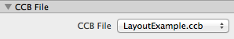 | **CCB File**: As an editor-only node that acts as a way to embed SpriteBuilder documents (CCB files) in other documents, the Sub File Node has only one property: the reference to the linked CCB File document. **Caution**: It is possible to create an infinite recursion through Sub File nodes. Doing so [will cause a runtime error](https://github.com/spritebuilder/SpriteBuilder/issues/761).

