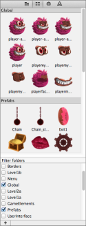
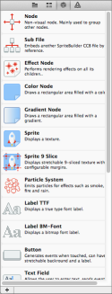
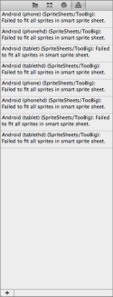
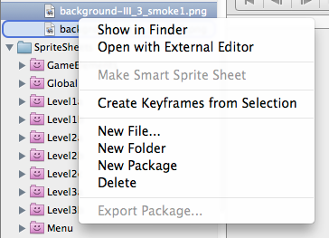

# The Resource Browser Tabs

The Resource Browser provides access to the project's files (File View), the project's images and prefabs (Tileless Editor View) and the available nodes (Node Library View). It also shows any warnings and errors (Warnings View) that may occur when publishing the project.

**File View / Preview** | &nbsp; | **Tileless Editor View** | &nbsp; | **Node Library View** | &nbsp; | **Warnings View**
:- | :- | :- | :- | :- | :- | :-
 | &nbsp; |  | &nbsp; |  | &nbsp; | 
**Top**: *File Preview* with details & settings.  **Bottom**: *File View* lists resource files. | &nbsp; | **Top**: Thumbnails of images and documents.  **Bottom**: Filter displayed items. | &nbsp; | Lists built-in nodes and physics joints. | &nbsp; | Publishing warnings will be listed here.
 
The **files and thumbnails** in the **File View**, **Tileless Editor View** and **Node Library View** **can be dragged and dropped** either onto the Stage or the Timeline to create new nodes of the appropriate kind. For example dragging an image and a SpriteBuilder document onto the Stage or Timeline will create a Sprite and a Sub File node.

The **[+]** button in the bottom left corner allows you to add files, folders and packages. 

### File View Context Menu

Right-click a file or folder in the **File View** to open a context menu.

**File View Context Menu** | 
- |
 |

<table border="0"><tr><td width="48px" bgcolor="#ffa0ff"><strong>TBD</strong></td><td bgcolor="#ffa0ff">
The non-self-explanatory menu items (sprite sheet -> graphics, create keyframes -> animation) will be explained in not yet existing articles. Reminder: add links.
</td></tr></table>
