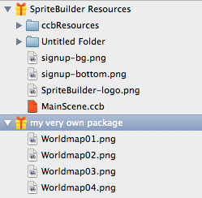
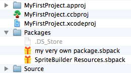
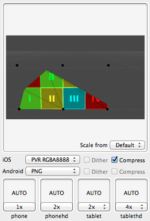
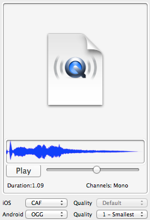

# Resource Files

SpriteBuilder manages (most) resource files of a project. In game development, resource files are often referred to as *assets*, as in [*digital asset*](http://en.wikipedia.org/wiki/Digital_asset). 

## Importing Resource Files

SpriteBuilder only accepts resource files via drag and drop. Use Finder to drag a resource file or folder onto the File View. When dropping you can specify which already existing folder the resource file should be added to. Be sure to drop files only on the File View area, pictured below.

When you drag & drop a resource file or folder onto the File View, SpriteBuilder will try to import the file(s). All unsupported files are silently ignored. Supported files (see below) are copied to one of the SpriteBuilder Packages in the `<projectname>.spritebuilder/Packages` folder when imported. The original file is left untouched.

## Updating Resource Files

To update an already imported resource file, you can either directly edit the file inside the package. 

Or you can select the resource file in SpriteBuilder's File View. Then drag the updated (or new) resource file onto the file's preview area rather than the File View itself. This will update the resource file without changing the resource file's name.

## Renaming/Moving Resource Files

You can double-click any file to rename it, or use drag & drop to move it to a different folder.

<table border="0"><tr><td width="48px" bgcolor="#ffd0d0"><strong>Caution</strong></td><td bgcolor="#ffd0d0">
Moving or renaming resource files may not update already created nodes referencing the renamed/moved resource file. It's recommended to have agreed on a reasonable file and folder naming conventions and layout before adding a great number of resource files. See [this issue](https://github.com/spritebuilder/SpriteBuilder/issues/464) for details.
</td></tr></table>

## SpriteBuilder Packages

Packages are essentially just folders that are treated like files by Finder. Packages were introduced to make it easier to move data between users and between projects.

After adding a new Package to SpriteBuilder's File View it will show the packages as the root folders for resource files.

Peeking inside the .spritebuilder folder with Finder reveals the SpriteBuilder Packages as "files" with the `.sbpack` extension.

<table border="0"><tr><td width="48px" bgcolor="#d0ffd0"><strong>Tip</strong></td><td bgcolor="#d0ffd0">
If you right-click on a package in Finder, it will give you the *Show Package Contents* option that allows you to browse into a package to see its files and folders. The contents of the `.sbpack` packages resembles what you see in SpriteBuilder's Filew View plus additional metadata files.
</td></tr></table>

## Supported Resource Files

SpriteBuilder only accepts certain file types and formats. The following file formats with the given extensions can be added as resource files:

File Type | Extension | Format/Version | Notes
- | - | -
Images | `.png` / `.psd` | Any PNG/PSD should work. | To use other image file formats first convert them to PNG.
Audio Files | `.wav` | Signed 16-Bit PCM (Microsoft) | To use other audio file formats first convert them to WAV.
Bitmap Fonts | `.bmfont` | Folder with .bmfont extension containing subfolders ([format specification](https://github.com/spritebuilder/SpriteBuilder/blob/develop/Documentation/9.%20Using%20Bitmap%20Fonts.md)) | Compatible Bitmap Font Editors are bmGlyph and Glyph Designer.
Truetype Fonts | `.ttf` | Any TTF should work. | To use other truetype font formats first convert them to TTF.

### Adding Unsupported Resource Files

Any file not accepted by SpriteBuilder would have to be either converted to an accepted format, or you can add that resource file directly to the Xcode project. However in the latter case you will not be able to reference said file within SpriteBuilder.

The list of supported file types may be extended in the future. You can [make requests here](https://github.com/spritebuilder/SpriteBuilder/issues). 

Note that the decision to limit the number of file formats is a pragmatic one - it makes programming and maintaining SpriteBuilder easier if one can assume all audio files to be in the WAV format for instance. There's no need to include various third party libraries in order to load and internally convert input files. There's no need to expose settings that define how file types are supposed to be converted during import. SpriteBuilder is mainly concerned about efficiently post-processing files when publishing rather than pre-processing files at the import stage. Once you know the supported formats, you can adapt your workflow accordingly.

## Publishing Options

When publishing, SpriteBuilder post-processes resource files to optimize them for size, quality or speed of loading. This may also change the file extension.

<table border="0"><tr><td width="48px" bgcolor="#ffffc0"><strong>Note</strong></td><td bgcolor="#ffffc0">
When referencing post-processed files in code you should always use the extension of the file in SpriteBuilder (ie .wav), not its published extension (ie not .m4a). This ensures that the file can be found even if you change the output format or if you run the game on Android where the file extension and format may have to be different.
</td></tr></table>

### Image Publishing Options

Publishing options of a selected resource file can be set in the File View's preview area.

The following table explains the possible post-processing options and output formats for images.

<table border="0"><tr><td width="48px" bgcolor="#d0f0ff"><strong>Info</strong></td><td bgcolor="#d0f0ff">
The abbreviation *bpp* stands for "bits per pixel", an image format with 24 bpp allows each pixel to take on one color out of about 16.7 million while a 16 bpp format allows each pixel to take on one of 65,536 colors.
</td></tr></table>

Format | Extension | Options | Availability | Notes
- | - | -
PNG | `.png` | PNG 8-Bit (Android only) | iOS, OS X, Android | The most commonly used image format for mobile games.
PVR | `.pvr` `.pvr.ccz` (if compressed) | **RGBA8888** (24 bpp, 8-Bit alpha) **RGBA4444** (12 bpp, 4-Bit alpha) **RGB565** (16 bpp, no alpha) **Optional dithering** for 16/12 bpp formats | iOS, OS X, Android (only uncompressed) | PVR is the recommended image format, compressed (`.pvr.ccz`) in particular. Creates small files that load very quickly. Losless compression.
PVRTC | `.pvr` | 4 bpp, 2 bpp | iOS, OS X | Only available for images with "power of two" dimenstions. Lossy compression, can cause artifacts (color bleeding). PVRTC textures render fast while consuming little memory. Good for fast-moving, small objects (bullets, particles).
JPG | `.jpg` | high, medium or low quality | iOS, OS X | Lossy compression, can cause artifacts (color bleeding). Usage is generally discouraged due to JPG not being available on Android and taking long to load on iOS.

### Audio Publishing Options

Audio files have a clear dividing line between Apple and Android operating systems. On iOS and OS X you can use Core Audio and MP4 audio but not OGG, while on Android the opposite is true. Below is the preview area with settings for an audio file.

The following table explains the possible post-processing options and output formats for audio files.

Format | Extension | Options | Availability | Notes
- | - | -
Core Audio Format (CAF) | `.caf` | - | iOS, OS X | Ideal for short sound effects. Audio files shorter than 15 seconds default to CAF format.
MPEG-4 Part 14 (MP4) | `.m4a` | Quality/Size Ratio: 1 (smallest) to 8 (best quality) | iOS, OS X | Ideal for long audio. Audio files longer than 15 seconds default to MP4 format.
Ogg | `.ogg` | Quality/Size Ratio: 1 (smallest) to 8 (best quality) | Android | -

### Font Publishing Options

Bitmap and TrueType fonts are not post-processed but merely copied "as is" without modifications.

## Published Resource Files and Source Control

Published resource files do not belong in source control. SpriteBuilder automatically creates a .gitignore in SpriteBuilder projects that exclude the following folders:

- `Source/Resources/Published-iOS`
- `Source/Resources/Published-Android`

If you do not use git for source control be sure to add these paths to your source control software's exclusion list for every SpriteBuilder project.

Contributors and collaborators then need to open the project in SpriteBuilder and publish the project before continuing/starting to work every time the latest changes have been pulled/synched.

<table border="0"><tr><td width="48px" bgcolor="#ffd0d0"><strong>Caution</strong></td><td bgcolor="#ffd0d0">
Including the published resource files in source control is strongly discouraged. It would only bloat your project, increase the commit history, cause more merge conflicts, and can ultimately leave the published files in an undefined state (especially when changes are merged). Debugging such issues can potentially waste a lot of time, especially if you don't consider having the published files under source control being at the root of the problem.
</td></tr></table>
