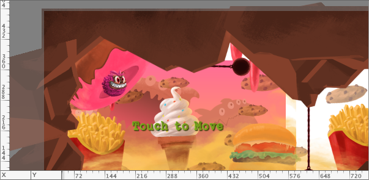
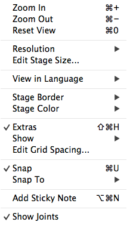
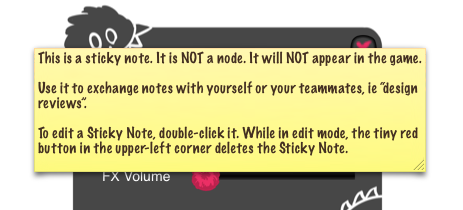
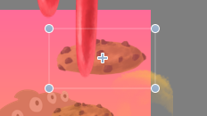
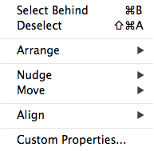

# Stage and Nodes

The Stage shows a visual representation of the currently active SpriteBuilder document. SpriteBuilder documents are often referred to as "CCB files" because they carry the `.ccb` extension.

## Working with the Stage

You can change most of the behavior of the Stage via the Document menu.

**Document Menu** |
- |
 |

- **Zoom** the view in and out. Reset View sets the Zoom level to 1:1.
- **Resolution** changes enable you to see what the document would look like if it ran on an iPhone vs and iPad, for example. In Scene documents changing Resolution will also change the frame around the Stage contents.
- **Language** enables you to view the document in a different **language**. This will change the text of all labels with localized text.
- **Stage Border** allows you to change the border of a Scene document. 
- **Stage Color** allows you to change the background color of a non-Scene document.
- **Show** menu allows you to show or hide the Guides (rulers), the Grid and Sticky Notes.
- **Snapping** allows you to control snap to grid and snap to node. You can edit the grid spacing as needed.
- **Sticky Notes** are little notes drawn over the document content. They are not nodes and will not appear in your game. Double-click to edit a Sticky Note, while editing the red button in the upper left corner deletes the Sticky Note.

### Panning the Stage

To pan the stage, keep the Command (Cmd) key pressed, then left-click and drag with your mouse to move the Stage contents.

## Working with Nodes on the Stage

Within the Stage you can select nodes by clicking on them. Toggle through the nodes at the same location by using the **Select Behind** shortcut: `Cmd+B`.

Selected nodes will draw a selection rectangle. Depending on where you hover the mouse cursor over the node's selection rectangle, the mouse cursor will change into one of the following icons to indicate the type of operation you can perform when clicking and dragging from this point.

&nbsp; | Move Node | Move Anchor | Rotate Node | Scale Node | Skew Node
- | :-: | :-: | :-: | :-: | :-:
**Displayed Icon** |  |  |  |  | 
**Cursor Location** | on node | on anchor | near a corner | on a corner | between corners

All of these operations can also be performed by entering values in the corresponding property fields in the Inspector View.

### The Object Menu

The Object menu items perform actions on the selected node(s).

**Object Menu** |
- |
 |

- **Select Behind** toggles through the nodes underneath the selected node (if any).
- **Arrange** changes the draw order of the node(s). Drag & drop in the Timeline does the same.
- **Nudge** and **Move** both change the position of the node(s) by fixed distances. Nudge moves by 1 point, Move by 10 points.
- **Align** aligns the selected nodes in various ways. You can even align nodes to pixel boundaries, which can be useful to avoid rendering artifacts (ie blurred text).
- **Custom Properties** brings up the custom properties dialog for the selected node. Same as the Edit Custom Properties button on the Properties Inspector. Custom properties can only be edited if the selected node uses a custom class (see Code Connections Inspector).
