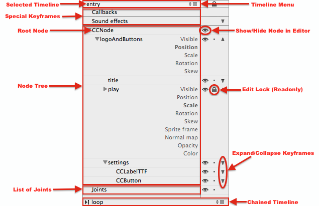
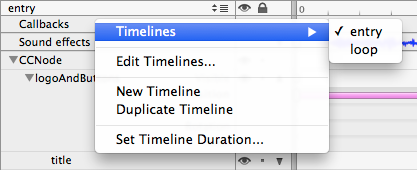
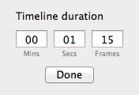
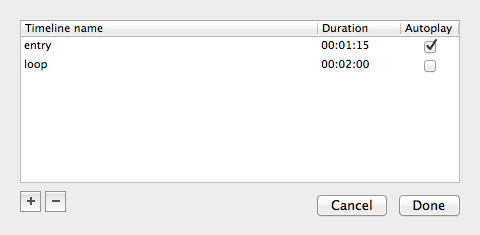
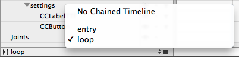
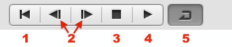

# Timeline and Node Tree

The Timeline itself is divided into three areas. The "Timeline Toolbar" (top) with Playback and Timeline Controls, the Node Tree (left) and the Keyframes Editor (right).

, zoom and duration controls (2), the Node Tree (3) and the Keyframes Editor (4)")

1. **Playback Controls** allow you to rewind, step through, stop, play and toggle looping the current Timeline.
2. **Zoom and Duration** will change the Keyframe Editor's zoom level and the duration of the current Timeline.
3. **Node Tree** presents the document's nodes in a hierarchical view, plus additional entries for Callback and Sound Effect Keyframes (top) as well as listing the document's Physics Joints (bottom) and giving you access to more Timeline menu items at the very top (Timeline Selection) and bottom (chained Timeline).
4. **Keyframe Editor** is used to add, move and remove Keyframes and to edit the Interpolation Mode of Keyframe Segments (pink bars).

## Node Tree

The Node Tree combines several unrelated items in its pane:

- The **Timeline Menu** shows the currently selected Timeline, named *entry* in this example. Left-clicking the Timeline Menu area brings up a popup menu with Timeline related items.
- **Special Keyframes** are not part of the Node Tree. They exist to provide a means to edit Callback Keyframes that run a selector, and Sound Effects Keyframes that play a sound effect.
- The **Node Tree** contains at least one node, the document's *Root Node*, sometimes simply referred to as *doc root*. Other Nodes are presented in hierarchical order with their editor names.
- **Joints** presents a list of Physics Joints in the document, if any.
- **Chained Timeline** is another left-click menu allowing you to specify the next Timeline in the chain (sequence), if any. Here the Timeline named *loop* will automatically be played back once *entry* has completed playback.
- **Node Tree Controls** allow you to:
    - Show/Hide a node and its children in the editor (eye icon).
    - Make the node and its properties read-only (lock icon).
    - Expand/Collapse the node's Keyframes (arrow icon).

<table border="0"><tr><td width="48px" bgcolor="#d0ffd0"><strong>Tip</strong></td><td bgcolor="#d0ffd0">
The eye icon changes the show/hide status of a node only in the editor display. Change the node's *Visible* property if the node should be shown/hidden when the app runs.
</td></tr></table>

## Working with the Node Tree

In the Node Tree you can **multi-select** one or more nodes just like you can select items in Finder: hold down the `Shift` or `Cmd` key to select multiple nodes.

<table border="0"><tr><td width="48px" bgcolor="#ffffc0"><strong>Note</strong></td><td bgcolor="#ffffc0">
Only sibling nodes can be in a multi-selection. In this example you can multi-select the nodes *title*, *play* and *settings* but you can't include the node *logoAndButtons* in that multi-selection.
</td></tr></table>

You can drag and drop selected nodes to change their order in the hierarchy. The order in the hierarchy determines the **draw order** of the nodes.

Selected nodes support **cut, copy and paste** operations. See the `Edit` menu items for possible operations and keyboard shortcuts. By default copied nodes are pasted as siblings via `Cmd+V` but they can also be pasted as children via `Shift+Cmd+V`.

Double-click a node in the Node Tree to **edit the node's editor name**. 

<table border="0"><tr><td width="48px" bgcolor="#ffffc0"><strong>Note</strong></td><td bgcolor="#ffffc0">
The name of a node in the Node Tree is not available in the published app. Edit the node's <em>Name</em> property instead. Changing the node's <em>Name</em> property will apply the string as the node's editor name only if the node's editor name has not already been edited. It is therefore possible that the node's editor name and the node's <em>Name</em> property may contain different text.
</td></tr></table>

## Timeline Menu

Left-clicking on the Selected Timeline's name brings up the Timeline Menu:

The first entry (highlighted) lets you quickly switch between multiple Timelines. 

Edit Timelines brings up a dialog to manage documents with multiple Timelines.

Timeline Duration brings up the same Timeline Duration dialog as does clicking on the Timeline Cursor time stamp in the upper right corner of the Timeline view.

## Timeline Cursor

")

The Timeline Cursor is the blue vertical line that indicates what timestamp within the Timeline is currently being displayed in the document.

You can grab the Timeline Cursor by its handle, which is the thick part drawn on the ruler with timestamp markers.
You can drag the Timeline Cursor cursor left and right. This allows you to change the current timestamp and you can see the effect of the current Timeline Animation on the Stage.

The current Timeline Cursor timestamp is displayed in the upper right corner of the Timeline view.

The Timeline Cursor is automatically moved when using the Timeline Playback controls to play or step through the Animation. If you double-click a Keyframe the Timeline Cursor will jump to that Keyframe.

<table border="0"><tr><td width="48px" bgcolor="#ffffc0"><strong>Note</strong></td><td bgcolor="#ffffc0">
Node properties that are animated (have keyframes) are only editable if the Timeline Cursor is exactly on the same position as the Keyframe. Otherwise the animated property will be readonly in the Inspector View.
</td></tr></table>

## Keyframe Editor Zoom and Timestamp

The Keyframe Editor **Zoom Slider** (left) changes the zoom level of the Keyframe Editor.

The **Timestamp** shows the current position of the Timeline Cursor in the format `minutes(0-59) : seconds(0-59) : frames(0-29)`. Clicking on the Timestamp display brings up the Timeline Duration dialog.

## Timeline Duration Dialog

The Timeline Duration Dialog is used to set the duration of the currently active Timeline. It can be brought up either via the Timeline Menu or by clicking on the Timestamp display.

The valid value ranges are as follows:

- Mins: 0-59
- Secs: 0-59
- Frames: 0-29

<table border="0"><tr><td width="48px" bgcolor="#d0f0ff"><strong>Info</strong></td><td bgcolor="#d0f0ff">
Timeline duration frames only range from 0 to 29 because the Keyframe Editor works with a fixed frequency of 30 frames per second. Nevertheless if the app runs at 60 fps the animation will be interpolated, meaning Timeline animations do run at the same framerate as the app. The editor just doesn't allow you to have more than 30 keyframes per second, which is more than plenty (one Keyframe every 0.033 seconds).
</td></tr></table>

## Edit Timelines Dialog

Accessible via the Timeline Menu, the Edit Timelines dialog allows you to add, rename, remove timelines as well as assigning which of the Timelines is set to Autoplay.

The **[+]** and **[-]** buttons add or remove a selected Timeline.

Double-clicking a Timeline in the list allows you to edit its name.

<table border="0"><tr><td width="48px" bgcolor="#d0f0ff"><strong>Info</strong></td><td bgcolor="#d0f0ff">
The Timeline Duration can not be changed from within this dialog. Refer to <em>Timeline Duration Dialog</em> above.
</td></tr></table>

The **Autoplay** checkbox marks one of the Timelines as the one that starts playing automatically when the document is loaded in the app. 

<table border="0"><tr><td width="48px" bgcolor="#d0ffd0"><strong>Tip</strong></td><td bgcolor="#d0ffd0">
To prevent any Timeline from playing automatically, simply create a new Timeline, set its Autoplay flag and then click Done to close the dialog. Then edit the Timeline's duration to `00:00:00` so it finishes instantly. See <a href="https://github.com/spritebuilder/SpriteBuilder/issues/441">this issue</a>.
</td></tr></table>

## Chained Timeline

At the very bottom of the Node Tree area you can left-click the Chained Timeline to bring up the menu that allows you to select which Timeline is followed the current one (chained timelines aka sequence).

You can select one of the Timelines available in the current document. The default entry *No Chained Timeline* causes playback to stop.

Chaining Timelines causes the playback to continue with the Timeline selected in as the Chained Timeline. Note that each Timeline has its own Chained Timeline setting. Changing the Chained Timeline setting only affects the currently selected (active) Timeline.

For example, you can make the *entry* Timeline chain to the *loop* Timeline while the *loop* Timeline chains to itself, causing the *loop* animation to play forever. If the *Autoplay* flag is set on the *entry* Timeline, the document (once loaded) will automatically play back the *entry* Timeline once, then continues with the *loop* Timeline, repeating it forever.

<table border="0"><tr><td width="48px" bgcolor="#d0f0ff"><strong>Info</strong></td><td bgcolor="#d0f0ff">
The chained (sequenced) playback occurs only in the app. Chained Timelines are ignored when playing a Timeline in the editor.
</td></tr></table>

<table border="0"><tr><td width="48px" bgcolor="#d0ffd0"><strong>Tip</strong></td><td bgcolor="#d0ffd0">
To play a specific Timeline a finite number of times before continuing with the Chained Timeline requires duplicating the Timeline the desired number of times, then chaining the duplicate Timelines together so each is chained to the next.
</td></tr></table>

## Timeline Playback

The selected Timeline can be played with the Playback Controls.

1. **Rewind** moves the Timeline Cursor to the start of the Timeline (`00:00:00`).
2. **Frame Step** buttons move the Timeline Cursor one frame backward respectively forward.
3. **Stop** stops playing the animation. It does not reset the Timeline Cursor. Actually it's more like a Pause button in that respect.
4. **Play** starts playing the Animation from the position of the Timeline Cursor.
5. **Loop** is a toggle button, when pressed the Timeline playback will loop until stopped.

<table border="0"><tr><td width="48px" bgcolor="#d0f0ff"><strong>Info</strong></td><td bgcolor="#d0f0ff">
Note that playing back a Timeline will also play back the Autoplay Timeline of Sub File nodes in the current document.
</td></tr></table>
