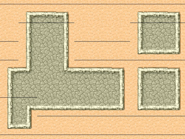

# Troubleshooting Tilemaps

There are a number of things that could go wrong when working with tilemaps. This article explains some of the common problems and describes solutions or workarounds.

## Tileset Image not found

Tiled, and possibly other editors too, will import a tileset image using a relative path. The path assumes the location of the TMX file to be the working directory, which makes the path of the imported tileset image relative to the TMX location.

This often creates an unusable tileset image path such as `../../../MyProjects/MyGraphics/TilesetImages/street-tiles.png`. Such a path will most likely be invalid in an app bundle. 

It is strongly recommended to save or copy tileset images into the folder where the TMX file is located. Then add the tileset image. This should generate a path without any folders, for instance: `street-tiles.png`. Open the .tmx file in a text editor to verify tileset path names.

<table border="0"><tr><td width="48px" bgcolor="#d0ffd0"><strong>Tip</strong></td><td bgcolor="#d0ffd0">
You can also use subfolders of the TMX file, however in that case you will have to add the folder containing tileset images as a *folder reference* (blue icon) in Xcode so that the subfolders are preserved when Xcopy copies resources into the app bundle.
</td></tr></table>

### Moving or renaming a Tileset Image

If you find out that your tileset image location is wrong only after spending time designing the tilemap in the tilemap editor (ie Tiled), it may not be possible to change the tileset image location from within the editor itself in a non-destructive way. But you can manually edit the image path:

- close the tilemap editor (ie Tiled)
- open the TMX file with a text editor
- locate all the `<tileset .. />` elements whose source attributes you want to change
- move/rename the tileset image according to the filename and path used in the source attribute
- save the TMX file in the text editor
- open the TMX in the tilemap editor

## "Black Line" Artifacts (specifically while scrolling)

Specifically when scrolling a tilemap you may sometimes see black lines appearing all over the map. They may appear only very briefly, for seemingly a single frame. But they can also appear permanently at a specific location. 

An example of horizontal black lines can be seen below, but vertical or differently colored lines may also occur and have the same cause.

### Cause

The culprit here are gaps that occur due to [floating point rounding errors](http://programmers.stackexchange.com/questions/101163/what-causes-floating-point-rounding-errors). To use a simplified example, in a tileset where tiles are 32x32 points one tile gets drawn at position 100,100 while the next is drawn at 133,100 - one off due to rounding errors, thus introducing a gap between the two tiles. 

What you see as black lines is actually the default background clear color which happens to be black, hence the name of the artifact because "black lines" are most commonly observed. But if you had, say, a color node or sprite in the background of the tilemap your "black line" gaps may be of a different color.

### Solution

Round the position of any tile layer, the tilemap itself, and any of its parent nodes if you change their positions to actual pixel coordinates. 

Most developers who said that doing so had no effect on their "black line" artifacts probably forgot to consider the node hierarchy which makes any node's position relative to its parent node's position, whose position in turn is relative to the parent's parent position.

So assuming that the CCTiledMap instance is a child of the scene, and the scene's position is 0,0 at all times then you don't need to consider the scene's position at all. If you initally set the CCTiledMap's position to 200, 155 and never again change it, you will not have to apply the position correction to the CCTiledMap instance either.

So assuming you are changing a specific CCTiledMapLayer node position every frame you need to round its position to the nearest pixel coordinate after applying the new position, like so:

	// Objective-C
	CGFloat scale = [CCDirector sharedDirector].contentScaleFactor;
	CGFloat newX = round(layerNode.position.x * scale) / scale;
	CGFloat newY = round(layerNode.position.y * scale) / scale;
	layerNode.position = CGPointMake(newX, newY);

	// Swift
	let scale = CCDirector.sharedDirector().contentScaleFactor
	let newX = round(layerNode.position.x * scale) / scale
	let newY = round(layerNode.position.y * scale) / scale
	layerNode.position = CGPoint(x: newX, y: newY)

Basically, rounding or casting to int isn't enough. You have to consider Retina displays and the fact that the position property is in points, not pixels. Therefore you need to consider positions like 10.5,47.5 to be valid on Retina displays but you want them to be rounded to integers on non-Retina devices.

This is what multiplying with scale followed by dividing by scale does. On Retina display scale will be 2.0 so a coordinate of 213.298 becomes 426.596, is rounded to the nearest integer (427.0) and then divided by two again, resulting in 213.5. On non-Retina devices 213.298 would be effectively rounded to the nearest integer, which is 213.0 in this case.

Ensuring that tile coordinates always exactly match pixel coordinates is the only effective solution for this problem.

### Solutions that don't really work

You may find the recommendation to change a "stretch texels" config setting or otherwise draw your tiles larger than they are. These workarounds fix the gaps, but they introduce new ugly artifacts, most notably aliasing where the entire map seems to be "drowning in pixels" when it moves at relatively slow speeds.

## Tiles bleeding into other Tiles

This effect is the same that can occur with any texture atlas. A tileset image is also just a texture atlas from which smaller images are drawn.

Refer to [this](http://stackoverflow.com/questions/7894802/opengl-texture-atlas-bleeding) and [this](http://gamedev.stackexchange.com/questions/46963/how-to-avoid-texture-bleeding-in-a-texture-atlas) example for manifestations of tile bleeding.

Typically most bleeding is fixed by simply applying the "black line" fix above. However different issues can occur when the tilemap rendering mode isn't set to linear filtering.

### Cause

If two texture atlas images are close by, and texture filtering is performed by the GPU, pixels from adjacent images in the texture atlas may "bleed" into the image you're drawing. This often manifests itself by colored or black borders around the edges of the image.

### Solution

One solution is to use either linear filtering (no texture filtering) to render the tilemap, which is the default mode. This allows you to use tightly packed tileset images without any spacing/padding.

The other solution is to design or generate tileset images with appropriate spacing and padding. Commonly a 2 pixel padding between tile images and a spacing of 2 pixels from the texture borders are sufficient to prevent any kind of tile bleeding.
