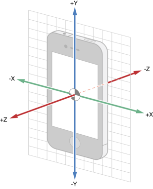

# Core Motion (Accelerometer, Gyroscope)

Cocos2D does not have built-in support for accelerometer and gyroscope. These input events are provided by the *Core Motion* framework.

The main difference to input events supported by CCResponder is that Core Motion events will be sent to one particular node, typically the scene. 

To use Core Motion you follow these simple steps:

- Create an instance of [`CMMotionManager`](https://developer.apple.com/library/ios/documentation/CoreMotion/Reference/CMMotionManager_Class/) and assign it to a class property or ivar
- Set the update interval
- start accelerometer or gyroscope updates
- in the `update:` method, read the motion manager's acceleration/gyroscope property for updated values

<table border="0"><tr><td width="48px" bgcolor="#ffd0d0"><strong>Caution</strong></td><td bgcolor="#ffd0d0">
On the iOS Simulator Core Motion returns zero for all motion values. You have to test Core Motion functionality on an actual device!
</td></tr></table>

## Creating an instance of CMMotionManager

You will need to assign the CMMotionManager instance to a class property because you'll need to be able to access updated values (typically in the `update:` method) and eventually you'll have to stop updates as well. A minimal setup requires this code in any node of your choice, typically you'll want to make the Core Motion updates in the scene, the "game layer" node or the node that you want to control via motion updates.

	// Objective-C
	@implementation MainScene
	{
	    CMMotionManager* _motionManager;
	}

	-(id) init {
		self = [super init];
		if (self) {
			_motionManager = [CMMotionManager new];
		}
		return self;
	}

	// Swift
	class MainScene: CCNode {
    	let _motionManager = CMMotionManager()
	}
	
<table border="0"><tr><td width="48px" bgcolor="#ffffc0"><strong>Note</strong></td><td bgcolor="#ffffc0">
You should not register multiple nodes to receive Core Motion events at the same time. Instead, make the motion manager property public to access it from other classes.
</td></tr></table>

## Starting and Stopping Motion Updates

It's best to set the accelerometer and gyroscope update intervals to the same rate as the display refresh rate, which is stored in the CCDirector property animationInterval and defaults to `1.0 / 60.0` (60 Hz). Then start accelerometer updates. You would normally do this in one of the initialization functions, be it `init`, `didLoadFromCCB` or `onEnter`.

	// Objective-C
    _motionManager.accelerometerUpdateInterval = [CCDirector sharedDirector].animationInterval;
    [_motionManager startAccelerometerUpdates];
    _motionManager.gyroUpdateInterval = [CCDirector sharedDirector].animationInterval;
    [_motionManager startGyroUpdates];

	// Swift
    _motionManager.accelerometerUpdateInterval = CCDirector.sharedDirector().animationInterval
    _motionManager.startAccelerometerUpdates()
    _motionManager.gyroUpdateInterval = CCDirector.sharedDirector().animationInterval
    _motionManager.startGyroUpdates()

To stop motion updates at a later time you just need to call:

	// Objective-C
    [_motionManager stopAccelerometerUpdates];
    [_motionManager stopGyroUpdates];

	// Swift
    _motionManager.stopAccelerometerUpdates()
    _motionManager.stopGyroUpdates()

If you only need to use the accelerometer, simply omit the gyroscope code from the above code examples. And vice versa if you only need the gyroscope.

## Obtaining Accelerometer & Gyroscope Values

To receive motion value updates you simply check periodically for new values. Typically you'll want to use the `update:` method for that.

	// Objective-C
	-(void) update:(CCTime)delta {
	    CMAcceleration acceleration = _motionManager.accelerometerData.acceleration;
    	NSLog(@"accel x: %f, y: %f, z: %f", acceleration.x, acceleration.y, acceleration.z);
    	
	    CMRotationRate rotationRate = _motionManager.gyroData.rotationRate;
	    NSLog(@"gyro x: %f, y: %f, z: %f", rotationRate.x, rotationRate.y, rotationRate.z);
	}

	// Swift
    override func update(delta: CCTime) {
        if let accelData = _motionManager.accelerometerData {
            let acceleration = accelData.acceleration
            NSLog("accel x: %f, y: %f, z: %f", acceleration.x, acceleration.y, acceleration.z)
        }
        
        if let gyroData = _motionManager.gyroData {
            let rotationRate = gyroData.rotationRate
            NSLog("gyro x: %f, y: %f, z: %f", rotationRate.x, rotationRate.y, rotationRate.z)
        }
    }

Acceleration values are provided via a [CMAccelerometerData](https://developer.apple.com/library/ios/documentation/CoreMotion/Reference/CMAccelerometerData_Class/index.html) object (which may be nil) which contains a [CMAcceleration property](https://developer.apple.com/library/ios/documentation/CoreMotion/Reference/CMAccelerometerData_Class/index.html#//apple_ref/c/tdef/CMAcceleration) containing the raw acceleration values.

Similarly, gyroscope values are provided via a [CMGyroData](https://developer.apple.com/library/ios/documentation/CoreMotion/Reference/CMGyroData_Class/index.html) object (which may also be nil) which contains a [CMRotationRate property](https://developer.apple.com/library/ios/documentation/CoreMotion/Reference/CMGyroData_Class/index.html#//apple_ref/c/tdef/CMRotationRate) containing the raw gyroscope values.

## Filtering Accelerometer Values

The raw accelerometer values are typically unsuitable for controlling a game or a game character. The values react very sensitive to device chances which makes the resulting motion unsteady, jumpy, jittery. The solution is a so-called *low-pass filter* which is easy to implement.

You need a property/ivar in the class for each of the x,y,z components you want to filter. They ought to be of type `double`/`Double`. In this case they are called `accelerationX`, `accelerationY` and `accelerationZ`. Of course you can omit the calculations for the axis you don't need, ie in 2D games you'll mainly just need to filter X and Y components.

	// Objective-C
    const double kFilterPercent = 0.1;
    accelerationX = (acceleration.x * kFilterPercent) + (accelerationX * (1.0 - kFilterPercent));
    accelerationY = (acceleration.y * kFilterPercent) + (accelerationY * (1.0 - kFilterPercent));
    accelerationZ = (acceleration.z * kFilterPercent) + (accelerationZ * (1.0 - kFilterPercent));
    NSLog(@"filtered accel x: %f, y: %f, z: %f", accelerationX, accelerationY, accelerationZ);

	// Swift
    let kFilterPercent = 0.1;
    accelerationX = (acceleration.x * kFilterPercent) + (accelerationX * (1.0 - kFilterPercent));
    accelerationY = (acceleration.y * kFilterPercent) + (accelerationY * (1.0 - kFilterPercent));
    accelerationZ = (acceleration.z * kFilterPercent) + (accelerationZ * (1.0 - kFilterPercent));
    NSLog("filtered accel x: %f, y: %f, z: %f", accelerationX, accelerationY, accelerationZ);

The `kFilterPercent` constant represents a percentage in the range 0.0 (0%) to 1.0 (100%). At 0.1 (10%) the filter will cause the new accelerometer value to contribute only 10% to the already filtered value. So over the course of 10 frames the current acceleration value will gradually change to the one that the device is pointing at. 

This delay causes accelerometer motion to be much smoother but it also introduces a certain amount of lag. So you may need to experiment to find the best value for `kFilterPercent` for your particular use case.

<table border="0"><tr><td width="48px" bgcolor="#ffffc0"><strong>Note</strong></td><td bgcolor="#ffffc0">
The same filtering can be applied to gyroscope data but doing so may be counterproductive because you may want to specifically react to sudden changes, at least more so than with accelerometer values.
</td></tr></table>

## Working with Accelerometer Coordinates

In the [Core Motion guide](https://developer.apple.com/library/ios/documentation/EventHandling/Conceptual/EventHandlingiPhoneOS/motion_event_basics/motion_event_basics.html#//apple_ref/doc/uid/TP40009541-CH6-SW4) you'll find this neat graph that explains the directions of the accelerometer axis:

What's crucial to understand here is that these values do not change with respect to device and interface orientation, nor with the coordinate system used by the framework (UIKit vs OpenGL/Cocos2D). 

Depending on whether the game runs in LandscapeLeft or LandscapeRight orientation, you may have to invert the X and Y axis values (ie multiply with -1.0). Furthermore, in any landscape orientation, the Y axis is actually the horizontal axis while the X axis is the vertical axis. 

Hence you'll find the assignment of accelerometer values to a node's position slightly odd on first sight:

	// Objective-C
    node.position = ccpAdd(node.position, ccpMult(CGPointMake(-accelerationY, accelerationX), 0.02));

	// Swift
    node.position = ccpAdd(node.position, ccpMult(CGPoint(x: -accelerationY, y: accelerationX), 0.02))

This example uses the filtered acceleration values from the previous paragraph. The 0.02 constant is simply a speed modifier to slow down movement to a reasonable rate. You'll need to tweak this to your needs.

Alternatively you can also feed the accelerometer values directly into `node.physicsBody.velocity` if you intend to control a node with a physics body. Assigning accelerometer values to the velocity property is preferred for nodes with a physics body because it allows the node/body to behave physically correct (ie bouncing back off of other bodies).

<table border="0"><tr><td width="48px" bgcolor="#d0ffd0"><strong>Tip</strong></td><td bgcolor="#d0ffd0">
If you use the accelerometer to control your game's character you should disable autorotation. Otherwise the interface orientation may change unintentionally while controlling the game, which will confuse the player and possibly even invert the controls if the interface orientation change is not accounted for when applying the acceleration values.
</td></tr></table>

And then there's the issue of calibration. You can not expect players to play on a flat surface at all times. Most players will want to play at an angle, or even lying down holding the device above them. This requires you to calibrate the device to a desired orientation which is then used as the reference orientation. Tilting the device should then be relative to the reference orientation.

To add to this, you will have to consider the case where the X axis reaches -1.0 (or 1.0) and then suddenly starts going back towards 0.0 as the user tilts the device past the 90° angle. You will have to look at the sign of the Z coordinate to determine which way the device is being tilted, whether the user actually is turning back or simply turned the device past the 90° angle.
