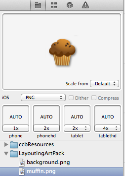

#Assets in SpriteBuilder

SpriteBuilder provides a couple of nice features to handle assets in Cocos2D games:

- **Automatic downscaling** - only the hightest resolution for each asset needs to be provided
- **Smart Spritesheets** - automatic generation of performance efficient sprite sheets
- **Support for multiple resolutions** - multiple options make it easier to support different resolutions using the same assets

##Adding assets to a SpriteBuilder project

Assets can be added to a SpriteBuilder project by simply dragging the files or folders into the resource panel:

##Setting up Smart Spritesheets
When turning a folder of resources inside a SpriteBuilder project into a Smart Spritesheet, SpriteBuilder will automatically generate one large image out of all of the assets. This allows the device to load all the assets into memory at once and will improve the rendering speed.

To transform assets into a spritesheet, right-click onto the folder and select *Make Smart Sprite Sheet*:

##Autosizing settings

SpriteBuilder is set up by default to downsize assets from a 4x resolution (double resolution of retina images). In case a game does not support tablets and only provides assets of lower resolution this setting can be changed. 
Open *File > Project Settings* to change this setting:

##Image sizes on different devices

The following image displays the different default resolution types per device (example size on a regular iPhone is 50x50):

SpriteBuilder provides settings to define which image resolution is used on which device on a per image basis. Selecting an image in the left panel will bring up these settings:

##Override scaling settings

You can override the scaling settings for any image in your project: Just drag and drop the overriding image to one of the four drop targets (See red arrows). Select the image in the file view and use the settings pane. If you are not happy with the default scaling provided by SpriteBuilder, you can manually scale the image and drop it into the settings pane.

##Audio files
Add sounds to your project by dragging them to the file view. By default, SpriteBuilder will select adequate export options for the sounds (CAF and MP4 for iOS and OGG for Android). You can specify the over all compression settings in the project settings or change them on a per-file basis.

##CCFileUtils and SpriteBuilder
In order to find resources within a game's bundle Cocos2D uses a utility class called `CCFileUtils`. `CCFileUtils` can be configured for each individual game, however most of the time developers will want to use the default configuration. SpriteBuilder sets `CCFileUtils` up to work with the SpriteBuilder project structure. Assets are searched by directory mode (not suffix mode) and the folder *iOS-Published* is added to the `CCFileUtils` search path. 

If developers need to add resources to an Xcode project and not through SpriteBuilder they need to understand how `CCFileUtils` is configured (currently one reason to add additional resources are externally generated Spritesheets, they cannot be added within the SpriteBuilder project). Developers need to add a new folder reference to their Xcode project and should add that folder to the `CCFileUtils` search path.